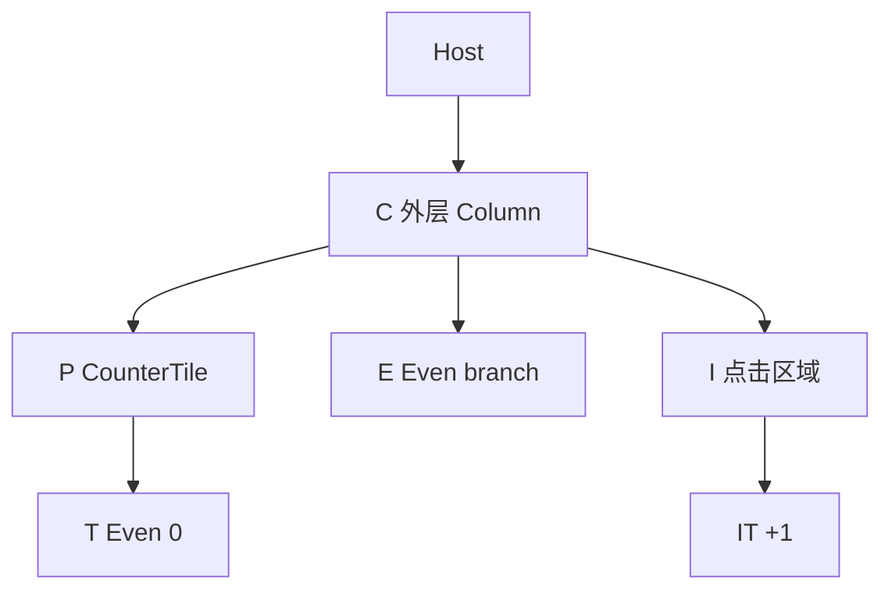
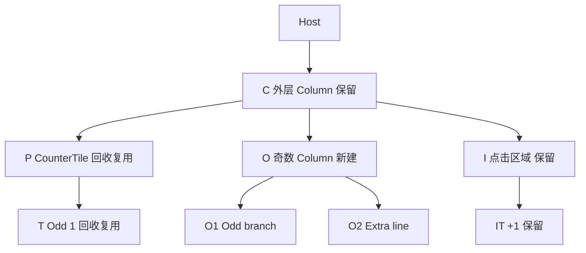
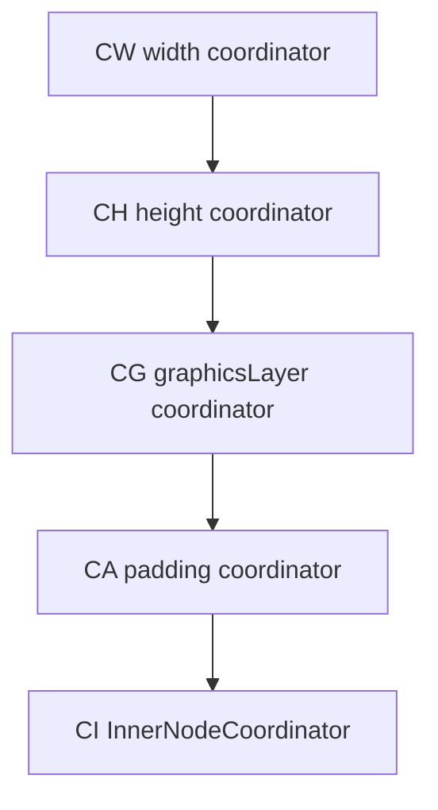

# Compose 1.12.1 Counter 从点击到屏幕呈现的源码全链路

本文供 Android 开发者阅读，也供后续 AI 制作源码教学视频。它从一个实际 Counter 的首次组合开始，追踪一次 `0 → 1` 点击，直到重组变更应用、布局和图层绘制完成；最后再解释第二次点击与优化变体。

核心事实是：状态写入、重组函数执行、SlotTable 更新、LayoutNode 修改、Modifier.Node 差分、测量、放置、图层参数更新、绘制指令录制和屏幕呈现，是彼此关联但不同的步骤。一次点击不会把所有对象重建。下面用固定对象编号把这些步骤连起来。

## 1 版本与证据范围

核对日期为 **2026 年 10 月 1 日**。这里的“Compose 1.12”具体锁定 **AndroidX Compose 1.12.1**，即 1.12 系列当时最新稳定补丁版。Runtime 发布说明注明 1.12.1 相对 1.12.0 没有变更；UI 与 Foundation 也有对应的 1.12.1 发布记录。[S01] [S01U] [S01F]

本文固定使用 AndroidX 官方源码仓库：

- 仓库：`https://android.googlesource.com/platform/frameworks/support`
- 发布说明中 1.12.1 的 commits 区间终点：`5e0747401bf56b243e3b5141ae080dc9bc61d29c`
- 对应 `libraryversions.toml`：`COMPOSE = "1.12.1"`、`COMPOSE_RUNTIME = "1.12.1"`。[S02]
- 后面的源码链接均指向这个 SHA，不指向会变化的 `androidx-main`。
- Runtime、UI、Foundation、Foundation Layout 是本文的版本单位；Material3 有独立版本，本例不依赖 Material3。
- Compose 编译器插件随 Kotlin 发布，**不存在把本文编译器称作“Compose Compiler 1.12.1”的做法**。编译器版本与选项必须另外固定。[S72]

### 1.1 三种证据标签

**源码事实**：已经读取上述提交对应的实现，章节末尾给出文件定位。

**基于源码推演**：根据示例与实现重建执行过程。例如预期保留哪些 LayoutNode、哪些 setter 被调度。这不是设备日志。

**教学示意**：group 标签、示意 SlotTable 行号、简化 compiler lowering、对象编号与时间段。它们服务于解释，不冒充编译产物、真实地址或实测时间。

这里没有在 Android 设备上编译、运行并抓取这个 Counter 的完整 SlotTable。因而不会编造编译器生成的整数 key、change mask、物理槽位偏移、字体测量像素或 GPU 时间。本文仍会把源码能确定的存储格式、调用关系、生命周期和每一步前后状态明确写出来。若要制作“真实内存转储”视频，附录提供补齐编译与运行证据的方法。

### 1.2 1.12 的两个 Composer

1.12.1 中有 `GapComposer` 和 `LinkComposer`。`ComposeRuntimeFlags.isLinkBufferComposerEnabled` 在这个提交中默认为 `false`；`CompositionImpl.createComposer()` 根据该标志选择实现。因此主线按默认 **GapComposer 加 gapbuffer SlotTable** 展开。LinkBuffer 的物理结构另见第 27 节。[S03] [S04]

不要拿旧版本的 `ComposerImpl` 路径直接套进 1.12：本提交的实现已拆分为 `GapComposer.kt`、`LinkComposer.kt`，传统 SlotTable 已位于 `composer/gapbuffer/SlotTable.kt`。

## 2 完整示例与安排理由

配套文件为 `Counter.kt`。它可以作为已有 Android Compose 工程中的源文件，工程应统一使用 Runtime、UI、Foundation、Foundation Layout 1.12.1，并使用与项目 Kotlin 版本一致的 `org.jetbrains.kotlin.plugin.compose` 插件。这里交付的是完整示例源文件，未声称交付一个已构建 APK 的工程。

示例最关键的部分如下；完整 imports、文字样式、测量策略和点击控件在配套文件中。

```kotlin
@Composable
fun Counter() {
    val count = remember { mutableIntStateOf(0) }
    val n = count.intValue
    val even = n % 2 == 0
    val increment = remember(count) { { count.intValue += 1 } }

    Column(
        Modifier.padding(16.dp),
        verticalArrangement = Arrangement.spacedBy(8.dp),
    ) {
        ReusableContent(even) {
            val prefix = remember { if (even) "Even" else "Odd" }
            val decoration = if (even) {
                Modifier.background(Color(0xFFD8F3DC), TileShape)
            } else {
                Modifier.border(2.dp, Color(0xFF3B82F6), TileShape)
            }
            CounterTile(
                label = "$prefix $n",
                modifier = Modifier
                    .width(200.dp)
                    .height(80.dp)
                    .graphicsLayer {
                        alpha = if (even) 1f else 0.65f
                        scaleX = if (even) 1f else 0.9f
                        scaleY = scaleX
                        clip = true
                        shape = TileShape
                    }
                    .then(decoration)
                    .padding(if (even) 12.dp else 20.dp),
            )
        }

        if (even) {
            BasicText("Even branch", style = BodyTextStyle)
        } else {
            Column {
                BasicText("Odd branch", style = BodyTextStyle)
                BasicText("Extra line", style = BodyTextStyle)
            }
        }
        IncrementControl(onClick = increment)
    }
}
```

`CounterTile` 在同一个调用位置执行一次 `Layout`，内容为一个 `BasicText`。它的静态 MeasurePolicy 测量文字后，返回 padding 以内的最大可用尺寸，并把文字放在自己的 `(0, 0)`。这种明确的尺寸策略让我们可以算清 coordinator 的边界，不必把 Box 默认的最小尺寸传播规则混进主线。

`IncrementControl` 是 200dp × 48dp 的 Box，使用显式 `MutableInteractionSource` 和 `indication = null` 的 clickable。这会保留点击、焦点及语义处理，但排除了 ripple 绘制对本次图层讲解的干扰。

本例有 **两个不同性质的 if/else**：

1. 第一个决定 Modifier 的 decoration，`CounterTile` 的调用位置始终相同。显式 `ReusableContent(even)` 使 key 改变时走节点回收复用路径。
2. 第二个包含真正的 Composable 分支。偶数分支为一个文字节点，奇数分支为一个 Column 和两个文字节点，能直接看到 group 和 LayoutNode 子树的删除与插入。

**只有 if/else 并不会自动开启回收模式。** `Layout` 本身使用 `ReusableComposeNode`，表示该节点有复用资格；这不等于每次普通重组都调用 `onReuse()`。是否进入回收模式由 `ReusableContent` 等设施决定。[S07] [S21] [S65]

## 3 六种对象结构 必须分别画出来

| 结构 | 保存什么 | 本例的关键对象 | 谁改变它 |
|---|---|---|---|
| Snapshot 状态记录 | 状态对象与各快照可见的值 | `count` 与 IntStateStateRecord | 状态 setter 与 Snapshot |
| Composition group 与 slots | 调用位置、重启 scope、remember、旧参数、节点引用 | Counter group、ReusableContent group | Composer 与 SlotReader/SlotWriter |
| LayoutNode 树 | UI 布局父子关系 | Column、CounterTile、BasicText | UiApplier 与节点属性 setter |
| Modifier 描述结构 | 不可变 Element 与 `CombinedModifier` | width、height、graphicsLayer 等 | Kotlin 代码每次声明 |
| Modifier.Node 与 delegate 链 | 持久的行为对象与状态 | SizeNode、PaddingNode、BackgroundNode | NodeChain 差分及生命周期 |
| coordinator 与 layer 结构 | 测量包装、坐标空间、绘制隔离与平台绘制资源 | LayoutModifierNodeCoordinator、OwnedLayer | NodeChain、placement、Owner |

Composable 函数本身不是 Android View，也不是一个永久保留的“函数对象节点”。一个 Composable 可以生成零个、一个或多个 LayoutNode；一个 Modifier.Element 也可能对应一个委托树，不能假定所有东西一比一对应。[S21] [S23] [S24] [S25]

## 4 对象编号与点击前后 UI 树

下列 ID 是教学用身份标签，跨镜头保留同一个 ID 表示对象身份不变。

| ID | 含义 | 首次出现 | 第一次点击后的预期 |
|---|---|---|---|
| S0 | `count` 状态对象 | 首次组合 | 同一对象，值变为 1 |
| RC | Counter 的重启 scope | 首次组合 | 被失效并重新执行 |
| C | 外层 Column LayoutNode | 首次 apply | 保留 |
| P | CounterTile LayoutNode | 首次 apply | 回收复用，执行 onReuse |
| T | 面板 BasicText LayoutNode | 首次 apply | 回收复用，更新文字 |
| E | `Even branch` 的 BasicText LayoutNode | 首次 apply | 移除 |
| O | 奇数分支 Column LayoutNode | 第一次点击 apply | 新建 |
| O1 | `Odd branch` 的 BasicText LayoutNode | 第一次点击 apply | 新建 |
| O2 | `Extra line` 的 BasicText LayoutNode | 第一次点击 apply | 新建 |
| I | IncrementControl 的 Box LayoutNode | 首次 apply | 保留 |
| IT | `+1` BasicText LayoutNode | 首次 apply | 保留 |

把宿主生成的额外布局包装统一称为 Host，不把它们伪装成本例只有一个确定根节点。表中只统计示例直接产生的节点。[S21] [S41] [S42] [S70]

点击前的父子关系：



点击后的父子关系：



视频把这两个树画成前后状态即可。真实 apply 中，删除、插入和属性设置可能交错；不能把这两张图误说成中间没有任何瞬态变更的内存事务。

## 5 编译器先把声明变成 Composer 协议

编译器会为需要的 Composable 添加 Composer 和 change/default mask 参数，生成重启 group、参数比较与跳过判断，并为分支和缓存提供能维持位置身份的 group/slot 协议。具体 group 边界、整数 key、lambda 缓存位置受 Kotlin Compose 编译器版本、inline 展开、strong skipping、源码信息选项等影响。[S06] [S72] [S73]

下面是 **协议示意，不是反编译结果**：

```kotlin
fun CounterLowered(composer: Composer, changed: Int) {
    val c = composer.startRestartGroup(K_COUNTER)
    if (mustExecuteCounter(c, changed)) {
        val count = c.cache(false) { mutableIntStateOf(0) }
        val n = count.intValue
        val even = n % 2 == 0
        val increment = cacheUsingCountIdentity(c, count) {
            { count.intValue += 1 }
        }
        // Column 和 lambda 的真实展开在这里省略
        c.startReusableGroup(207, even)
        val prefix = c.cache(false) { if (even) "Even" else "Odd" }
        emitCounterTileAtSameCallSite(c, prefix, n, even)
        c.endReusableGroup()

        if (even) {
            c.startReplaceGroup(K_EVEN_BRANCH)
            emitEvenText(c)
            c.endReplaceGroup()
        } else {
            c.startReplaceGroup(K_ODD_BRANCH)
            emitOddColumnWithTwoTexts(c)
            c.endReplaceGroup()
        }
        emitIncrementControl(c, increment)
    } else {
        c.skipToGroupEnd()
    }
    c.endRestartGroup()?.updateScope { nextComposer, force ->
        CounterLowered(nextComposer, changed or force)
    }
}
```

`207` 是本提交 runtime 的真实 `reuseKey`；`K_COUNTER`、`K_EVEN_BRANCH` 等是符号占位符。`cacheUsingCountIdentity`、`mustExecuteCounter`、`emit…` 是教学名字，不是 runtime 方法。此示意也没有声称编译器一定给两个分支生成恰好这两个 startReplaceGroup 调用。[S06] [S07]

要抓住三个机制：

- **startRestartGroup/endRestartGroup** 为可重启执行范围保存 scope 与重启 lambda。
- **remember/cache** 消费当前位置的 slot；命中则取旧值，插入、key 失效或回收时则重新计算。
- **分支 group** 让某个分支内增加或减少 slots/nodes 时，不会错把后面的 IncrementControl 当成它的旧内容。

Strong skipping 可以让参数没变的子 Composable 跳过，但不能让已经读到发生变化状态的 Counter scope 永远不执行。调用父函数也不代表每个子函数体都会运行。[S05] [S09] [S73]

## 6 SlotTable 物理格式

默认 gapbuffer SlotTable 有两块主要存储：`groups: IntArray` 与 `slots: Array<Any?>`。Groups 用扁平的先序布局保存树；每个 group 固定占五个 Int，而不是在内存里存一个普通树形 Group 对象。[S08]

| group 字段偏移 | 字段 | 含义 |
|---|---|---|
| 0 | Key | Composer 传入的整数 key |
| 1 | GroupInfo | node 标志、object key/aux 标志、mark 标志与 node count 位域 |
| 2 | ParentAnchor | 父 group 的内部定位编码 |
| 3 | Size | 包含自身与所有后代的 group 记录数 |
| 4 | DataAnchor | 对应数据区的定位编码 |

某个 group 的数据区可包含 Node、ObjectKey、Aux 等固定数据，再跟上普通 slots。**LayoutNode 引用是 node group 的 Node 数据；remember 结果和 Updater 保存的旧值是普通 slots。** group 的 data 不全部都是 remember 值。[S08]

### 6.1 group size 与 node count 不相同

Group size 衡量 composition group 记录占用多少行；node count 用于计算 Applier 目标树的节点贡献。物理 GroupInfo 中，node group 的 node count 保存其内容在该 node 内产生的孩子数；但是该 node group 向父级贡献的数量是 1。非 node group 向父级贡献其内容在当前 Applier 层级产生的节点数。因此不能把外层 Column 下的所有孙节点都算进 Column 的直接 child index。[S05] [S08]

本例点击前后，C 的直接 children 都是三个：

| child index | n 为 0 | n 为 1 |
|---|---|---|
| 0 | P | P |
| 1 | E | O |
| 2 | I | I |

奇数分支共有 O、O1、O2 三个 LayoutNode，但在 C 的 children 列表中只占 **O 一个位置**。这也是为什么 `remove(index=1, count=1)` 可以移除整个分支根，而不是 count=3。[S17] [S23]

### 6.2 gap buffer 与 Anchor

Writer 在 groups 与 slots 中维护 gap。逻辑 Index 与数组 Address 在 gap 之后可能不同；移动 gap 会移动一段数组数据。GapAnchor 让重启 scope 等对象能够跟踪 group，而不是一直缓存会失效的裸数组下标。重组时 reader 读取旧结构；插入内容使用单独 insertTable 和 writer；apply 再通过正式 writer 更新主表。[S05] [S08]

注意两个概念：ParentAnchor/DataAnchor 是 group 字段内的编码；独立 `GapAnchor` 对象是另一类定位器。它们不能在视频中全部画成同一个对象。

Reader 允许多个，Writer 独占；有 writer 时不能开 reader，有 reader 时不能开 writer。这个互斥规则是表结构的访问协议，不代表所有 Snapshot 状态读写都在这个锁里。[S08]

### 6.3 为什么不能任意往已匹配 group 加 slots

同一匹配 group 的 slot 布局要遵守编译器与 runtime 的位置协议。条件路径需要适当的 group 边界来承载不同结构，不能把任意一次 `remember` 插入解释为“后面所有 slot 自动随便平移而身份完全不变”。编译器缓存有时直接属于已有 group，**一处 remember 不一定对应独立 group**。[S06] [S08]

## 7 点击前 SlotTable 的教学视图

下表是 **把中间 wrapper/compiler group 折叠后的逻辑视图**。`G_Counter` 等 ID 不是物理 row index。`S(count)` 等是逻辑 slot 名称，不是绝对 slots 下标。

| 逻辑 group | 分类 | 关键数据或 slots | 对应 node |
|---|---|---|---|
| G_Counter | restart group | scope RC、S(count)=S0、increment 的 key/cache | 无 |
| G_Column | Column 的包装及 node group | Column MeasurePolicy、CompositionLocalMap、hash、modifier 旧值 | C |
| G_Reuse | reusable 普通 group | key=207，Aux=true，prefix cache="Even" | 无 |
| G_Tile | CounterTile restart 包装 | label="Even 0"、modifier 旧参数、scope | 无 |
| G_P | reusable node group | key=125、Node=P、Updater slots | P |
| G_T | BasicText 包装及 reusable node group | finalModifier 含 TextStringSimpleElement("Even 0") | T |
| G_Even | 偶数分支的 group 子树 | BasicText("Even branch") 的包装与 slots | E |
| G_Increment | restart 包装及 Box node group | 固定 onClick、interactionSource、Modifier | I |
| G_IncrementText | BasicText 的包装与 node group | "+1" 的 finalModifier | IT |

因为 `Column`、`Layout`、Composable lambda 的实际编译展开会带来额外 groups，这张表不能用于宣布“整个 Counter 恰好九个 group”。文字、语义、CompositionLocal 读取也可能增加缓存信息。我们保留的是 **对象与数据的正确归属**。[S05] [S07] [S21] [S39] [S42]

P 的 Layout node group 可以进一步按 runtime 明确协议展开：

```text
Node 数据       P 的 LayoutNode 引用
Updater 旧值 1  CounterTileMeasurePolicy
Updater 旧值 2  currentCompositionLocalMap
Updater 旧值 3  currentCompositeKeyHashCode.hashCode()
无 slot 的操作 reconcile(ApplyOnDeactivatedNodeAssertion)
Updater 旧值 4  materialized Modifier
接着进入 content 的子 groups
```

这是 `Layout(content, modifier, measurePolicy)` 在固定源码中的 update 顺序。不要用旧版讲解中单独 `SetDensity/SetLayoutDirection` 的列表替代本提交的 `SetResolvedCompositionLocals`。[S21] [S22]

## 8 首次 composition 与 apply 如何把 UI 生出来

第一次没有旧 groups/nodes 可读。Counter 进入 restart group，remember 遇到 `Composer.Empty`，创建 S0。首次读 S0 为 0，随后产生偶数路径、prefix="Even" 和相应 Modifier 描述。

对每一个 `Layout`，源码进入 `ReusableComposeNode`：先 `startReusableNode()`，插入模式中执行 `createNode(factory)`；普通更新模式执行 `useNode()`；之后运行 Updater、content，最后 `endNode()`。[S07] [S21]

**`createNode(factory)` 不是在那一行必然立即 new LayoutNode。** GapComposer 将 factory、插入位置与 group anchor 放入 insert fixups。`InsertNodeFixup.execute()` 在 apply 阶段调用 factory，写入 Node 数据，执行 Applier 的 top-down 插入协议并 `down(node)`；`PostInsertNodeFixup` 在子树准备后 `up()` 并 bottom-up 插入。[S05] [S18]

Android 的 UiApplier 忽略 `insertTopDown`，实际树连接由 `insertBottomUp → current.insertAt` 完成。因此子树可以先构建，待接入 attached 父节点时一并 attach，避免重复通知。[S17] [S23]

对暂未 attach 的 LayoutNode，Modifier setter 将描述保存到 `pendingModifier`；attach 时才应用 NodeChain、建立 coordinator、运行节点 attach 生命周期。对已 attach 的 LayoutNode，setter 直接进入 `applyModifier()`。[S23] [S24]

首次 apply 完成后，才有前面的 LayoutNode 树与 Modifier.Node 链。初始 measure/placement 会建立相关 layer，初始 draw 会录制绘制内容。视频应先快速建立这份基线，再慢放第一次点击。

## 9 点击事件 如何抵达 increment

按正常 Android 触屏输入，入口是 `AndroidComposeView.dispatchTouchEvent()`，经过 `handleMotionEvent()` 与 `sendMotionEvent()` 转换为 Compose PointerInputEvent，交给 `PointerInputEventProcessor.process()`。命中测试依据 LayoutNode/coordinator 的位置、尺寸和变换找到相关 PointerInput 节点，HitPathTracker 保存并派发命中路径。[S50] [S55] [S56]

Pointer 事件有 Initial、Main、Final 三个 pass；对于命中路径，Initial 从祖先到后代，Main 从后代到祖先，Final 再从祖先到后代。down 与 hover 会建立或更新命中路径，后续触屏事件沿已跟踪的路径派发；不能把每个 move 都画成从零重新命中整棵树。宿主在 handleMotionEvent 中还会先消化需要的 measure/layout，确保命中使用有效几何。此处不能画成“Android 直接通过按钮的 View.onClick 调用 Counter”。本例只有宿主 View，clickable 行为来自 Modifier.Node。[S50] [S55] [S56]

本版本普通 `ClickableNode` 直接处理 `onPointerEvent()`：Main pass 的 down 路径消费按下、保存 downEvent，启动 press interaction；有效 up 路径消费抬起，释放 press interaction，并 `performClick()`。`performClick()` 经平台点击声音处理再执行 `onClick()`。[S54]

这是 1.12.1 的实现细节：不要强行把普通 clickable 主线画成旧教程里的 `SuspendingPointerInputModifierNode → detectTapGestures` 协程。combinedClickable、其他手势和旧实现各有自己的路径。

因为本例没有 indication，press interaction 不会产生 ripple；它仍会更新交互状态与焦点相关行为。若 up 被取消、越界、消费或组件 disabled，就不保证走到 onClick。主线假设一次正常有效点击。

## 10 S0 的写入 从 0 变为 1

`increment` 捕获的是 S0，不是第一次组合得到的整数 n。因此它执行的是：

```kotlin
val old = count.intValue // 当前可见值 0
count.intValue = old + 1 // 写入 1
```

`mutableIntStateOf` 的核心实现是 `SnapshotMutableIntStateImpl`。Getter 通过 `next.readable(this)` 取当前快照可见的 IntStateStateRecord；setter 用当前记录比较值，只有不同才通过 `overwritable` 写入。[S11]

S0 对象身份不变。记录会按 Snapshot 协议选择可写记录或创建/复用版本记录，不能固定宣称“每次加一都 new 一个 StateRecord”，也不能画成“同一个全局 Int 裸字段无版本地直接覆盖”。StateRecord 的 snapshotId 和版本可见性参与读写。[S10] [S11]

**等值写入**不会按这个 Int setter 的路径触发有效状态变化。这里只讨论 0→1。对于通用 `mutableStateOf`，则要看 SnapshotMutationPolicy；不要用其 structuralEqualityPolicy 名字描述专用 Int setter 的直接比较。

点击 handler 的读写发生在 composition 执行范围之外。它的读不是一次“Counter 新订阅”；composition 订阅来自第一次执行 Counter 时的 `val n = count.intValue`。也不能把点击写入直接等同于在重组快照里的 `CompositionImpl.recordWriteOf()` 调用。[S04] [S10] [S13]

## 11 从写入通知到 Counter 失效

Android 的 `GlobalSnapshotManager.ensureStarted()` 注册 global write observer。第一次待处理写入向容量为 1 的 channel 发送信号；AndroidUiDispatcher.Main 上的协程调用 `Snapshot.sendApplyNotifications()`。这样多次写入通知能够合并，setter 不需要同步跑完整重组。[S12]

Recomposer 的 runner 注册 Snapshot apply observer，将已变更状态对象加入 `snapshotInvalidations`。`recordComposerModifications()` 把这些变更交给相关 Composition 的 `recordModificationsOf()`；Composition 通过 pending modifications 与 observations 查找读过这些状态的 scopes，并安排失效。[S04] [S13]

最初建立依赖时，重组执行快照的 read observer 调用 `composition.recordReadOf(S0)`。它从 `composer.currentRecomposeScope` 找到 RC，标记 used、记录读取，并加入 `observations` 中 S0→RC 的对应关系。[S04] [S09] [S13]

本例故意在进入 Column content 之前读取 `n`，所以 **直接状态依赖在 Counter 的 RC 上**。后面子函数收到的是普通 Int、Boolean、String 或 Modifier，不能因为文字最终显示 n，就画成所有 Text scopes 都直接订阅 S0。

失效记录保存 scope 与位置/anchor 等信息；Recomposer 还会把对应 Composition 放入待重组集合。此时屏幕通常仍是旧画面，LayoutNode 树也还是旧树。

## 12 帧调度与重组执行快照

常规 `runRecomposeAndApplyChanges()` 先 `awaitWorkAvailable()`，处理 snapshot 修改，有帧相关工作才等待 `parentFrameClock.withFrameNanos`。Android 的 FrameClock 与 AndroidUiDispatcher 使用 Choreographer 的帧回调。它不是一个每 16ms 无条件扫描所有 Composable 的循环。[S13] [S14] [S15] [S71]

帧回调中可以先广播 animation frame，再处理新状态失效，整理待重组 compositions，并调用 `performRecompose()`。重组执行在一个 mutable snapshot 里，它装有 composition read/write observers，完成后 apply 这个 snapshot 并检查冲突。[S13]

**mutable snapshot 的 apply 与 composition.applyChanges 是两件事**：前者提交快照状态写入，后者执行 UI/SlotTable 的 ChangeList。本例的主要 S0 写入来自点击，重组主要读取其值并生成 UI 更新。

主线按常规主线程串行 recompose-and-apply 模式。并行重组、PausableComposition、Lazy 预组合与 MovableContent 不是本例触发的路径。

## 13 Composer 定位失效范围 并决定执行或跳过

`GapComposer.recompose()` 处理失效集合并进入 `doCompose()`。它借助 SlotReader、失效位置和 restart scope 的重启 lambda 到达需要重启的位置；中间未失效的 groups 可以跳过。`skipToGroupEnd()` 在有嵌套失效时也可能进入子范围处理，不能把 skip 一律画成完全无条件跨过所有后代。[S05] [S09]

RC 直接读过 S0 且已经失效，Counter 的函数体需要再次执行。外层 `remember` 仍在原 group/slot 位置，因此取回 **同一个 S0**，而不是新建从 0 开始的 state。新读到 n=1，even=false；`remember(count)` 也命中，increment 仍是原 callback。[S05] [S06] [S07]

从这一步开始，程序会构造新的 Modifier 描述和 label。但真实已 attach 的 LayoutNode 属性变更仍由 ChangeList 在 apply 阶段执行。不能在这里直接把旧树整体涂成新树。

## 14 ReusableContent 的 key 改变

`ReusableContent(even)` 对应 `startReusableGroup(reuseKey=207, dataKey=even)`。SlotReader 的旧 groupAux 为 true，新 dataKey 为 false。GapComposer 在匹配的 reusable group 入口设置 `reusingGroup` 与 `reusing=true`，并安排更新 Aux。[S05] [S07]

回收模式中 `nextSlotForCache()` 对普通记忆值返回 `Composer.Empty`。因此内部无 key 的 `remember { if (even) "Even" else "Odd" }` 重新计算为 "Odd"。外部 S0 的 remember 不在这个 reusable group 内，不受这一重置影响。[S05]

注意这里的 slot 可能在物理上继续占用原位置，但**逻辑缓存值已失效并被替换**。不要把 `Composer.Empty` 画成 setter 之前就已经逐个改写所有正式 slots 的实际指令；这是 reader 在回收模式下呈现的读取语义。

`ReusableRememberObserverHolder` 有特殊保留协议，普通应用 `remember` 值按上述重置处理。这个内部特例不应被推广成“remember 在复用时都保留”。

本例 CounterTile 与其 BasicText 的 node 发出位置、类型和结构相同，都来自 `Layout → ReusableComposeNode`，所以其 LayoutNode P/T 可以保留。`GroupKind.Node` 在 reusing 时会 forceReplace，而 `GroupKind.ReusableNode` 可以复用；普通 group 也允许匹配。复用不是一个全局 node 池按类型随便抓取任意节点。[S05] [S69]

## 15 useNode 与 Updater 如何生成 ChangeList

`startReusableNode()` 进入 key=125 的 node group；在非 inserting 路径中 `useNode()` 从 Node 数据读出 P，并调度 Applier 导航。如果当前为 reusing 且 node 支持 ComposeNodeLifecycleCallback，还记录 `UseCurrentNode`。[S05] [S18] [S20]

Updater 的 `set(value, setter)` 对比该位置的旧值。如果 inserting 或值变化，就保存新旧值信息并 `composer.apply(value, setter)`。普通重组中这个协议只更新有变化的属性；回收时旧记忆值被呈现为空，所以相同 MeasurePolicy 等也可能需要重新应用。[S06]

对应 P，本次安排的属性涉及：MeasurePolicy、resolved CompositionLocals、compositeKeyHash、Modifier。ReusableContent key 参与 composite hash，不能认为 hash 在回收时一定不变。`reconcile` 的断言操作也会按其协议执行。[S21] [S22] [S65]

T 的 `BasicText` 在无 SelectionContainer、无 onTextLayout、无 autoSize 的条件下使用 `TextStringSimpleElement` 快路径；它仍然发出一个 LayoutNode，并把文字行为放入 Modifier.Node。[S42] [S43]

此时 label="Odd 1"，文字 element 变为新值，但 P/T 还没有换对象。ChangeList 保存的 update operation 会在之后对 `applier.current` 执行。

## 16 普通 if else 的 group 删除与插入

第二个 if/else 不在 ReusableContent 内。even=false 后，偶数分支的旧 group 子树不再生成；奇数分支的 Column 与两个 BasicText 是新分支结构。Composer 按 group 身份/位置匹配，安排移除 E 所在范围并插入 O、O1、O2。[S05]

原 E 不会因为“奇数分支也有 BasicText”就自动变成 O1。两个分支有不同调用身份和结构，而且这里没有回收容器把它们声明成同一复用内容。

IncrementControl 在分支之后的稳定调用位置，收到同一个 increment。满足编译器可跳过条件、locals 未失效时，函数体可跳过；即便因其他原因执行，普通匹配仍可使用原 I/IT，不需要回收生命周期。[S05] [S73]

强调：**跳过组合不等于跳过后续布局**。分支高度变了，I 的 y 位置仍会在父 Column 的 placement 中更新。

## 17 ChangeList 与正式表更新的边界

主线可以把结果表示为下列语义事件集合；这不是从真实运行提取的 operation 序列，真实导航合并、插入/删除排序与批处理会不同。

```text
更新 G_Reuse 的 Aux true → false
替换 prefix cache Even → Odd
导航到 P
UseCurrentNode(P)
应用 P 的 Layout updater setters
导航到 T
UseCurrentNode(T)
应用 T 的 finalModifier
移除旧偶数分支 groups 与对应节点 E
插入奇数分支 groups
执行 O / O1 / O2 的 node factory 和 setters
连接新分支子树
恢复 Applier 导航位置
```

正式 SlotTable 的 SlotWriter 更新 group/slot/Node 引用；ChangeList 同时执行目标树操作与 remember 管理操作。对于新内容，Composer 在 recompose 中已经向 insertTable 写出待插入结构，但没有等于提前修改完正式 UI 树。[S05] [S08] [S18] [S19] [S20]

如果普通 remember 对象实现 RememberObserver，forget/remember 等回调通过 RememberManager 管理。`CompositionImpl.applyChangesInLocked()` 在 applier.onEndChanges 之后派发 remember observers，再派发 SideEffect。本文 prefix 是 String，没有这些回调；S0 也不应被画成每次触发 onRemembered。[S04] [S68]

## 18 Applier 真正改树的过程

Composition 的 apply 外围调用 `applier.onBeginChanges()`；随后 `changes.execute(slotStorage, applier, rememberManager, …)`；结束调用 `applier.onEndChanges()`。[S04]

Applier 是 runtime 与目标节点系统的适配协议。runtime 并不内建“Counter 按钮、文字、Android View”的含义。Android UI 使用 `UiApplier : AbstractApplier<LayoutNode>`，它有 current 和导航栈。[S16] [S17]

| Applier 方法 | 本版本 Android UI 的作用 |
|---|---|
| down(node) / up() | 改变 current 与栈，不表示测量 |
| insertTopDown(index, node) | UiApplier 忽略，用于协议配对 |
| insertBottomUp(index, node) | current.insertAt(index, node) |
| remove(index, count) | current.removeAt(index, count) |
| move(from, to, count) | current.move(from, to, count) |
| apply(setter, value) | 把 setter 作用于 current |
| reuse() | current.onReuse() |
| onEndChanges() | 通知 root.owner.onEndApplyChanges() |

`UpdateNode` operation 的执行是 `applier.apply(block, value)`，例如执行 `SetModifier`。Applier 本身不遍历 Modifier.Element 做差分；那是 LayoutNode setter 引出的 NodeChain 工作。[S18] [S22] [S24]

Owner 的 onEndApplyChanges 还会清理待清的无效 snapshot 观察、处理相关 AndroidView/autofill 工作，并把 end-apply listeners 消化完。本例没有 AndroidView，但不能把这个回调当成“直接把所有像素画完”的入口。[S50]

当 E 从 C 的 index=1 移除时，`LayoutNode.removeAt` 先执行 child 的移除/detach 工作，再断开父关系。O 的两个孩子先完成构建，然后 O 接入 C；已 attached 的父节点会使新子树 attach 到 Owner。SlotTable groups 的变更与 LayoutNode children 列表变更由同一次 apply 的相关 operations 协调，但两者不是同一张表。[S17] [S23]

本例没有重排列表或 key 顺序变化，不需要为了教学强行制造 `move()`。当使用 `key(item.id)` 的列表重排时，Composer 才可能生成 move groups/node operations。

## 19 onReuse 保留对象但重置生命周期

`UseCurrentNode → applier.reuse → LayoutNode.onReuse()` 在 **apply 阶段**执行，并在相关 setter 之前。官方 runtime tests 明确覆盖了回收调用、回收时 remembers 失效、onReuse 在 apply 发生及先于 setter 发生。[S17] [S18] [S65]

`LayoutNode.onReuse()` 的关键顺序如下：[S23]

1. 检查 LayoutNode 仍 attached，处理 interop/subcomposition 的 reuse。
2. 若没有提前 deactivate，执行 `resetModifierState()`。
3. 给同一个 LayoutNode 生成新的 semanticsId，更新 Owner 的空间索引相关记录。
4. 把 Modifier.Node 链重新标记为 attached，执行 attach 生命周期。
5. 使语义失效，并恢复需要的 remeasure/relayout 请求与位置记录。

`resetModifierState → NodeChain.resetState()` 从尾到头对 attached nodes 调用 reset，再运行 detach 生命周期并 markAsDetached。reset 会调用 `Modifier.Node.onReset()`。随后 onReuse 重新 attach；因此有些同一对象会经历 **onReset → onDetach → onAttach**。[S24] [S25]

回收没有把 P 从 C.children 中删除，也没有把 P.owner 清空。这里是行为节点生命周期重置，而不是整个 LayoutNode 被移出布局树再重新 new。P/T 的 semanticsId 可以变化，说明“LayoutNode 身份保留”不等于“无障碍身份也保留”。

对于可委托的 Modifier.Node，要考虑 delegates 的 reset/detach/attach 传播。不要把一个 ClickableNode 的所有委托节点当成独立 sibling Element。

重要的真实顺序：P 的 onReuse 先把**旧链**重置并重新 attach，随后 SetModifier 再对旧链与新描述做差分。因此旧 BackgroundNode 可能先经历一次回收重新 attach，再因为新 decoration 是 Border 而 detach/remove。不能把这个额外生命周期剪掉后仍宣称视频是精确调用序列。

## 20 Modifier 描述结构与持久 NodeChain

链式 `.width().height().graphicsLayer().then(decoration).padding()` 产生一个 Modifier 描述结构。`then` 常以 CombinedModifier 保存 outer/inner，逻辑顺序从外到内。这个描述结构通常会在执行声明代码时产生新 Element/组合对象，但运行时的 Modifier.Node 可以保留。[S25]

Layout 会先 materialize modifier，然后通过 SetModifier 更新 LayoutNode。现代 node-based Elements 通常可以直接走 NodeChain；如果出现 `Modifier.composed`，materialize 会执行其 composable factory，涉及额外 composition 与缓存；如果出现旧 Modifier 接口，NodeChain 可以创建 BackwardsCompatNode。本文面板链不依赖这些兼容路径。[S21] [S57] [S58]

因此“Modifier 树重组”至少应拆成两个镜头：**composition 执行生成新描述**，然后 **apply 执行对持久 NodeChain 的差分**。这不是 Composer 使用 SlotTable 去逐一匹配每个 PaddingNode。

### 20.1 面板 Element 与 Node 的前后映射

| 外到内位置 | n=0 Element | n=1 Element | Node 前后结果 |
|---|---|---|---|
| 0 | width 200dp 的 SizeElement | 同值 SizeElement | W 同一 SizeNode |
| 1 | height 80dp 的 SizeElement | 同值 SizeElement | H 同一 SizeNode |
| 2 | BlockGraphicsLayerElement，偶数 lambda | 同类型，奇数 lambda | G 同一 BlockGraphicsLayerModifier，更新 block |
| 3 | BackgroundElement | BorderModifierNodeElement | B 删除，创建 D BorderModifierNode |
| 4 | PaddingElement 12dp | PaddingElement 20dp | A 同一 PaddingNode，更新参数 |

本提交 graphicsLayer 的 block node 还实现 SemanticsModifierNode；BackgroundNode 也含语义/观察能力。表中只给出主要职责，不应把 node.kindSet 限死成“graphicsLayer 只 Layout，background 只 Draw”。[S30] [S46]

BorderModifierNode 是 DelegatingNode，并委托 CacheDrawModifierNode 做绘制缓存。D 在外层 node 链占一个 element 位置，但其内部还存在 delegate。它不是新增 LayoutNode，也不因为画边框就必然新增 OwnedLayer。[S47]

### 20.2 NodeChain 的比较规则

`actionForModifiers(prev, next)` 在本提交中的规则为：[S24]

| 判断 | action | 行为 |
|---|---|---|
| prev == next | Reuse | 保留 Node，不调用 Element.update |
| 不相等但运行时同类型 | Update | 保留 Node，执行新 Element.update(node) |
| 类型不同 | Replace | 进入结构差分，删除/插入必要节点 |

`==` 取决于各 Element 的 equals 实现，不能统一解释为引用相同。BlockGraphicsLayerElement 还把 block 身份纳入相等比较，所以换了捕获 even 的 lambda 会需要更新。

`updateFrom()` 先展开 Modifier 描述为 Element vector。等长链尝试线性快路径；遇到 Replace 后，对剩余部分进入 structuralUpdate 和 Myers diff，保留能匹配的后缀。本例前两个同值、第三个同类型更新、第四个类型改变，所以第五个 PaddingNode 有机会继续匹配保留，并更新 12→20。[S24] [S27]

`ModifierNodeElement.update()` 如果 node attached，会按 kind 与 shouldAutoInvalidate 规则处理失效；若未 attached，则记录等待 attach 时执行的失效。新增/删除也有自己的失效流程。kindSet 与 aggregateChildKindSet 让后续 traversal 快速筛选节点与委托能力。[S24] [S26]

### 20.3 失效种类不是一律 remeasure

PaddingNode 的更新影响 Layout，因此会触发测量相关失效。Background/Border 的替换影响 Draw 与可能的 Semantics，新的绘制缓存也需建立。[S26] [S28] [S46] [S47]

BlockGraphicsLayerModifier 的 `shouldAutoInvalidate=false`，Element.update 显式设置 layerBlock 并调用 invalidateLayerBlock/updateLayerBlock；这条路径可以更新 layer 参数，不必为 alpha/scale 的变化单独重测所有内容。本例仍需 measure，因为 padding、文字与普通分支结构同时改变。[S30] [S31]

## 21 coordinator 怎样包住一个 LayoutNode

NodeChain 的 `syncCoordinators()` 从内到外扫描 Node 链。每个具有 LayoutModifierNode 能力的节点建立或复用一个 LayoutModifierNodeCoordinator；没有布局能力的节点关联到当前 coordinator；最内侧是 InnerNodeCoordinator。[S24] [S32] [S33]

面板的 coordinator 关系如下，箭头表示“外侧包装内侧”，不表示 LayoutNode 父子关系。



W、H、G、A 都是 LayoutModifierNode。Background/Border 的主链节点不增加布局包装层；它们位于 graphicsLayer 与 padding 之间，关联到 CA 的绘制坐标空间。D 的 draw delegate 从委托关系参与 Draw traversal。[S24] [S47]

width 和 height 虽都用 SizeNode，也仍是两个 element/node 和两个 coordinator。不能把逻辑上看起来像“200×80 的 size”就画成代码实际只创建了一个 SizeNode。[S29]

**OwnedLayer 的挂载位置**：G 在自己的 measure 返回的 placement block 中调用 `placeable.placeWithLayer`，放置的是内侧 CA。因此 layer L 在 **CA** 上，而不是自然地挂在 G 自己的 CG 上。NodeChain.getModifierInfo 的源码注释专门解释了 placeWithLayer 将 layer 放在下一个 coordinator 上；LayoutModifierNode.updateLayerBlock 也明确调用 requireCoordinator(Nodes.Layout).wrapped 的更新方法。[S24] [S30] [S31] [S74]

如果 graphicsLayer 是最后一个布局 modifier，下一层可能是 InnerNodeCoordinator；如果 modifier 顺序不同，层覆盖的内容与尺寸也不同。

P 回收时保留 LayoutNode，NodeChain 差分也保留 G/A，coordinator 可继续复用。onReuse 对 modifier nodes 的 detach/reset 不等于必然销毁这些 coordinators 的 OwnedLayer。主线可以画成保留同一逻辑 L；如果后续真实运行采用 layer 池，必须另标记平台资源身份，不要把逻辑 L、OwnedLayer wrapper、GraphicsLayer 和 RenderNode 都当成同一个对象。

## 22 measure 的底层调用链

Apply 会通过属性更新、node 插入/删除与失效标记提出 remeasure/relayout 请求。`LayoutNode.requestRemeasure()` 经 Owner 的 `onRequestMeasure()` 进入 `MeasureAndLayoutDelegate.requestRemeasure()`；Owner 按需要调度 Android requestLayout 或 invalidate。不是所有内部重新测量都必须让所有 Android 父 View 重跑 onMeasure。[S23] [S36] [S50]

Android `onMeasure()` 将 MeasureSpec 转为 Constraints，更新根约束并 `measureOnly()`；`onLayout()` 以及 `dispatchDraw()` 前的 `measureAndLayout()` 都可能消化待处理布局。主线把这些归成“本次绘制前完成需要的 measure/layout”，不武断规定每次点击都完整经历一个 Android onMeasure/onLayout。[S50]

`MeasureAndLayoutDelegate` 按节点深度与 pending 状态处理任务。节点 measurePending 或约束变化时，`MeasurePassDelegate.remeasure()` 进入 performMeasure，设置 layoutState=Measuring、清 measurePending，在 OwnerSnapshotObserver 的 measure read 观察范围中测量 outerCoordinator。[S34] [S36] [S37]

沿面板 coordinator 向内，布局 modifier 的 measure 依次修改约束并测量下一个 measurable。到 InnerNodeCoordinator 时，调用 P 的 MeasurePolicy，传入 P 的 childMeasurables，即 T 的 MeasurePassDelegate。BasicText 自身又沿其文字布局 node 测量内部 EmptyMeasurePolicy 节点。[S32] [S33] [S42] [S44]

measure 返回 MeasureResult：尺寸、alignment lines、placement block。这个返回值不表示子节点已经放到最终屏幕坐标。layout block 中的 place 调用在 placement 时运行。

### 22.1 本例约束的准确算例

为便于视频，约定示意环境 density=1、LTR，根有足够宽高；不要把这个约定当成真实手机密度。以下 dp 数值因这一约定可直接显示为 px。

width 与 height 会在父允许范围内把尺寸固定为 200×80。若父最大宽度不足 200 或高度不足 80，它们必须受父 Constraints 限制，下面算例不适用。它们不是 requiredWidth/requiredHeight。[S29]

| 层级 | n=0 约束或尺寸 | n=1 约束或尺寸 |
|---|---|---|
| 经过 width 和 height | min=max=200×80 | min=max=200×80 |
| graphicsLayer 测量内侧 | 原样传递 200×80 | 原样传递 200×80 |
| PaddingNode 收到 | 200×80 | 200×80 |
| PaddingNode 传给 CI | 176×56，min=max | 160×40，min=max |
| CounterTilePolicy 传给文字 | [0,176]×[0,56] | [0,160]×[0,40] |
| P 的 Inner MeasureResult | 176×56 | 160×40 |
| Padding 对外报告 | 200×80 | 200×80 |
| CG/CH/CW 对外报告 | 200×80 | 200×80 |

PaddingNode 计算左右/上下 padding 总和，把 constraints.offset(-horizontal,-vertical) 传给内侧，再 constrainWidth/constrainHeight 恢复外侧尺寸，并保存 placeRelative(start,top) 的 placement block。这与配套策略的计算完全对应。[S28]

### 22.2 文本底层测量

T 的 TextStringSimpleNode 使用 ParagraphLayoutCache.layoutWithConstraints()，解析文字、字体与约束，获取 Paragraph、layoutSize 与 baseline。它观察字体变化，并将测得尺寸作为精确约束传给内部 measurable。文字节点返回自身测量尺寸和 FirstBaseline/LastBaseline。[S44] [S45]

"Even 0" 与 "Odd 1" 不仅字符内容不同，宽度限制也由 176 变为 160，所以它的文字缓存可能重新布局。本文不提供虚构的文字宽高；平台字体、fontScale、字体加载与文字 shaping 都影响结果。用 `w_T0,h_T0` 与 `w_T1,h_T1` 表示实际测量值。

BasicText 在 composition 里还调用 BackgroundTextMeasurement。Android actual 实现读取 LocalBackgroundTextMeasurementExecutor；该 Local 默认是 null，本例未提供 executor，因此不执行应用指定的后台文字预热任务。若显式提供 executor 且文字长度与设备条件满足，才可能在后台计算 intrinsics 预热平台缓存；它不是所有文字都必然启动线程，也不取代 measure 阶段的正式布局。[S42] [S75]

正文 BasicText 的高度也不能简单宣称等于 16px。16sp 是字体尺寸，实际行高由 font metrics/style/fontScale 等决定。

### 22.3 是否重新测量所有孩子

Column 的 MeasurePolicy 会请求测量相关 children；请求 measure 不等于必然执行孩子的完整 measure 代码。子节点 pending=false 且 constraints 未变时，MeasurePassDelegate 可以沿缓存路径返回，必要时先处理子树的 pending 任务。[S34] [S39] [S40]

P 外侧尺寸保持 200×80，因此 P 的内部变化不必然向父级传播 sizeChanged。但第二个分支 E→O 的插入/移除和整体高度变化会使 C 需要重新处理布局。不要把这两条失效原因混为一谈。

如果一个被测子节点尺寸变了，MeasureAndLayoutDelegate 根据 `measuredByParent` 区分父级在 measure block 或 layout block 中使用该尺寸，分别提出父 remeasure 或 relayout 请求。[S36]

## 23 placement 如何确定坐标与 layer

处理 layoutPending 时，MeasurePassDelegate.layoutChildren() 在 OwnerSnapshotObserver 的 layout 观察范围中运行保存的 placement。layoutState 与 pending flags 用于避免错误重复执行，也允许布局过程中产生新请求。[S34] [S35] [S37]

配套 Column 使用 spacedBy(8dp)。以 C 最外侧原点为 `(0,0)`，外层 padding=16dp，有：

| 节点 | n=0 相对位置 | n=1 相对位置 |
|---|---|---|
| P 外边框 | (16,16) | (16,16) |
| 分支根 | (16,104) | (16,104) |
| I 外边框 | (16,112+H_E) | (16,112+H_O) |

这里 `H_E` 是偶数分支真实测量高度；`H_O = H_O1 + H_O2`，因为奇数 Column 没有额外 spacing。若 Host 把 C 放在屏幕偏移 `(x_C,y_C)`，则再加该偏移；Insets 或更上层 Modifier 也要在 Host 中处理。[S39] [S40]

P 内部 placement 按下面的局部坐标执行：W/H wrapper 放内侧 `(0,0)`；G 将 CA 放在 `(0,0)` 并附 layer block；A 将 CI 放在 `(12,12)` 或 `(20,20)`；CounterTilePolicy 把 T 放在 CI 的 `(0,0)`。

**布局坐标**中，T 的局部偏移由 `(12,12)` 变为 `(20,20)`。graphicsLayer 的 scale 不改变 measured width、父 Column 的 child 位置或兄弟节点布局；它改变绘制及相关坐标映射。不能把 P 的 layout size 改成 180×72。

奇数状态 L 的中心缩放为 0.9，layer 原始尺寸仍 200×80。忽略 Host 其他变换时：

```math
x_draw = 100 + 0.9 * (x_local - 100)
y_draw =  40 + 0.9 * (y_local -  40)
```

所以面板局部边界从 `[0,200]×[0,80]` 变成视觉 `[10,190]×[4,76]`；T 的原点 `(20,20)` 映射到 `(28,22)`。再加 P 的布局位置得到示意位置。这里算的是几何映射，不是字形可见轮廓。

layer 变换也会影响命中测试与 LayoutCoordinates 转换；“不影响 layout 尺寸”不表示它对所有几何观察都不可见。[S31]

## 24 layer 参数与平台资源

G 的 measure 透传尺寸，placement 使用 `placeWithLayer`。内侧 coordinator 的 `updateLayerBlock()` 在 attached 且 block 非空时创建或更新 layer；初次创建经 `Owner.createLayer()`，设置 resize/move，然后更新参数。[S30] [S31]

`updateLayerParameters()` 重置可复用的 GraphicsLayerScope，设置 density、layoutDirection、size，在 snapshot read 观察范围中运行 layer block，再调用 `layer.updateLayerProperties(scope)`。alpha、scale、clip、shape 等从 DSL 进入底层资源属性。[S31] [S51]

本例第一次点击后的参数为：

| 参数 | 点击前 | 点击后 |
|---|---|---|
| alpha | 1 | 0.65 |
| scaleX / scaleY | 1 / 1 | 0.9 / 0.9 |
| clip | true | true |
| shape | RoundedCornerShape 8dp | 相同 shape |
| layer 几何尺寸 | 200×80 | 200×80 |
| inner 内容尺寸 | 176×56 | 160×40 |

这里 block 捕获的是普通 Boolean even，它依赖 composition 重新生成/更新 block；它没有直接读 S0，所以不会通过 layer scope 单独订阅 count。

### 24.1 1.12 的 Android 默认后端

本提交 `AndroidComposeView.createLayer()` 优先处理 explicit GraphicsLayer，然后尝试 layer cache；正常新建的 API 23+ 路径使用 `GraphicsLayerOwnerLayer(graphicsContext.createGraphicsLayer(), …)`。因此不能把当前主线直接写成旧版 `createLayer → RenderNodeLayer`。[S50]

GraphicsLayerOwnerLayer 包装 GraphicsLayer。AndroidGraphicsLayer 与它的 impl 把属性和录制/绘制交给平台实现；API 29 的 GraphicsLayerV29 中有 RenderNode、beginRecording 与 drawRenderNode。低 API/特定能力下存在其他实现和兼容路径。[S51] [S52] [S53]

主线可以选择 **Android API 29+ 硬件加速且采用 V29 后端** 作为视频假设，并把对象分开画：

| 对象 | 身份 |
|---|---|
| L | 教学上的面板绘制层 |
| CA.layer | coordinator 持有的 OwnedLayer |
| GraphicsLayerOwnerLayer | OwnedLayer 的 Android wrapper |
| GraphicsLayer | Compose 图形 API 对象 |
| GraphicsLayerV29.impl 的 RenderNode | Android 显示列表与属性载体 |
| offscreen buffer | 合成时可能使用的渲染目标，不等于上述对象 |

### 24.2 layer 与离屏 buffer 不相同

存在 graphicsLayer 不代表永远先生成一张 Bitmap。它至少提供绘制内容隔离/录制与可独立更新的变换属性。默认 Auto compositing 下，alpha 小于 1 等情况可能使内容以离屏方式合成；Offscreen 是显式请求，ModulateAlpha 是另一种透明度策略，遇到内容重叠时结果可能不同。[S52] [S53]

本例的 0.65 是教学上展示合成的机会，但不要把“这个 Kotlin setter 同步 new 了一张 200×80 的 CPU Bitmap”当作源码事实。具体 buffer 分配、GPU 调度和屏幕提交在 Android 渲染系统里。

### 24.3 参数变更与内容失效

仅改变 scale/alpha 可以更新图层属性而复用已有显示列表；面板本次同时替换 background 为 border、改变 padding 和文字，所以 **内容绘制指令也需要更新**。两条更新路线都要展示，不能因为用了 graphicsLayer 就把文字更新画成不重新录制。[S31] [S44] [S51]

层的 block/update 可能在 apply 时通过 modifier update 提前运行，也可能在首次 placement/尺寸变化时运行。视频的概念顺序是先更新描述、后确保 layout/layer/draw 一致，不能声称 layer block 每帧恰好只调用一次，或一定只在 measure 之后调用。

## 25 从 DrawModifierNode 到 display list

`AndroidComposeView.dispatchDraw()` 在 draw 前先调用 measureAndLayout，随后经 CanvasHolder 进入 root.draw，并处理 dirty layers 的 display list 更新。宿主和框架可能还有内部层/绘制包装；不要把示例的 L 宣称为整个窗口唯一的层。[S50]

coordinator 有 layer 时，draw 经 OwnedLayer.drawLayer；没有 layer 时沿 coordinator 执行包含的 draw modifiers 与内部内容。NodeCoordinator 的 drawBlock 使用 SnapshotObserver 观察绘制阶段状态读；LayoutNodeDrawScope 通过 kind traversal 找到当前与后续 DrawModifierNode，并在正确坐标空间调用 draw。[S31] [S48] [S49]

偶数状态 BackgroundNode 在 200×80 的 CA 空间画背景，再 drawContent；PaddingNode 的布局偏移使文字内容位于 `(12,12)`。奇数状态 Border 的 delegate 使用 draw cache 准备 shape/path 等，再按其 drawContent 与边框绘制逻辑绘制内容和边框。Border 不从 Layout Constraints 中扣掉 2dp；它是绘制装饰。[S46] [S47]

T 的 TextStringSimpleNode 在 draw 中绘制已经测量的 Paragraph。文本 measure cache 和 border 的 draw cache 是两种缓存，不能混成“SlotTable 存着文字路径”。[S44] [S45] [S47]

`GraphicsLayerOwnerLayer.updateDisplayList()` 在 isDirty 时调用 `graphicsLayer.record(density, layoutDirection, size, recordLambda)`，recordLambda 调入 coordinator 的 drawBlock，然后清 dirty。`drawLayer()` 先确保 display list 更新，再绘制 GraphicsLayer。[S51]

在 V29 路径，impl.record 使用 RenderNode.beginRecording 获得 recording canvas，把 Compose 的绘制指令录入显示列表，完成录制；draw 用平台 canvas.drawRenderNode。这不是每条 drawText 都必然当场在 CPU 产生最终屏幕像素。[S53]

最终 Android 硬件渲染系统处理 RenderNode、合成与窗口缓冲提交，屏幕在后续显示刷新中呈现新内容。**Recomposer 的 applyChanges 返回、Compose dispatchDraw 返回、GPU 完成和像素被扫描显示，不是同一个时刻。** AndroidX 源码能确认到平台绘制调用边界；GPU/SurfaceFlinger 更细的调度不能从本例 AndroidX 文件里推断为确定毫秒数。

## 26 第一次点击结束后的全部关键状态

| 系统 | 最终状态 |
|---|---|
| Snapshot | S0 同一对象，当前可见 intValue=1 |
| Composition | Counter 读取重新登记，旧失效范围处理完；新分支 scopes 建立 |
| Reusable group | Aux true→false；内部 prefix 的逻辑缓存为 "Odd" |
| P/T Node 数据 | 仍引用原 LayoutNode 对象 |
| 普通分支 | E 的 groups 与节点移除；O/O1/O2 插入 |
| P Modifier 描述 | width、height、奇数 layer block、border、20dp padding |
| P NodeChain | W/H/G/A 保留；B 移除；D 与 draw delegate 新建 |
| 生命周期 | P/T 回收；保留的行为节点可以 reset/detach/attach；节点语义身份重置 |
| coordinator | 保留匹配的布局包装，更新链路；CA 对内内容区域缩小 |
| 测量 | 面板外侧仍 200×80，内侧从 176×56 变为 160×40 |
| placement | 分支根位置稳定；I 根据新 H_O 改 y；文字 offset=20dp |
| layer 属性 | alpha=0.65、scale=0.9、clip=true、尺寸=200×80 |
| 绘制内容 | 录制奇数 border、Odd 1 文字及新分支内容 |
| 平台呈现 | 通过 Android 图形系统提交与显示，时间不能用重组完成代替 |

第二次点击 1→2：ReusableContent 的 Aux false→true，prefix 再次计算为 Even；P/T 仍按同一复用结构保留，D 删除并新建背景 B2，padding 回到 12，alpha/scale 回到 1。普通奇数分支 O/O1/O2 删除，偶数分支新建 E2。E2 不是第一次点击前 E 的复活；B2 也不是原 B 的复活。

## 27 如果开启 LinkBuffer 实现

这是同一版本的替代实现。标志必须在第一次 setContent 之前设置，之后不能动态切换；R8 release 的 assumevalues 配置也参与选择，不能只在运行中设置 Boolean 就声称已切换生产包。[S03]

LinkComposer 的 SlotTable、Reader 和 Editor 位于 `composer/linkbuffer`，它仍提供 slots、groups、reader/editor、anchors 等能力，但通过 address space、group handles 与显式 group 链接管理结构，减少删除、移动、重排时的数组复制。它不是“每个 group 都是一个 Kotlin 对象的普通 LinkedList”。[S59] [S60] [S61] [S62] [S63] [S64]

| 内容 | 默认 GapBuffer | LinkBuffer |
|---|---|---|
| Composer | GapComposer | LinkComposer |
| group 存储讲解 | 五 Int 字段的先序 group 数组，gap 定位 | address space 与 group 地址/链接 |
| 编辑接口 | SlotWriter | SlotTableEditor/Builder |
| 定位对象 | GapAnchor | LinkAnchor 与相关 handles |
| 本文逻辑 UI 结果 | S0 变化、P/T 复用、分支替换 | 同一语义目标 |

制作主线视频时不要突然把 gapbuffer 的五 Int group row 动画用作 LinkTable 的精确物理转储。可以在结尾加入替代实现对照：**逻辑协议相近，物理编辑策略不同**。

## 28 三个优化变体 用来解释哪些阶段可以跳过

### 28.1 去掉 ReusableContent

保留同一位置 CounterTile、把 prefix 写成正常表达式 `if (even) "Even" else "Odd"`。普通重组依然通常保留 P/T，NodeChain 也会差分，但不会仅因为 n 改变就进入 onReuse 生命周期。若把无 key 的 `remember { prefix }` 原样移出 reusable 容器，则会保留旧 prefix，这是另一种行为，不应在对照版本里无意引入。[S05] [S07]

### 28.2 只在 graphicsLayer block 读状态

```kotlin
val count = remember { mutableIntStateOf(0) }
// 外面不读 count.intValue，也不改变文字、padding 或分支
Modifier.graphicsLayer {
    alpha = if (count.intValue % 2 == 0) 1f else 0.65f
}
```

这时 layer block 的 snapshot read 由 layer 参数观察范围登记。改变 S0 可以更新 layer 属性而不失效 Counter composition；也不必因 alpha 本身触发 measure。若同时在外面读 count 显示文字，那仍会产生 composition 依赖，不能用此变体的结论套回主例。[S31] [S37] [S38]

### 28.3 只在 draw lambda 读状态

```kotlin
Modifier.drawWithContent {
    drawContent()
    if (count.intValue % 2 != 0) {
        drawRect(Color.Blue.copy(alpha = 0.1f))
    }
}
```

仅绘制阶段的依赖可以使 draw/layer 内容失效，而不必重组或重新测量。layout、draw、layer 参数与 composition 各有自己的 snapshot read 观察范围，**状态对象不知道自己“必须重组”，真正决定工作的是读发生在哪个观察范围**。[S31] [S37] [S38]

## 29 视频分镜规范

建议做成 20 至 35 分钟的深入教学视频；如果目标短于 10 分钟，应拆成重组篇、Modifier 与布局篇、图层与绘制篇，不应把真实机制压缩成错误的一步动画。下面时间是内容安排建议，不是性能数据。

所有镜头保持五个同步区域：左上示例代码，右上实际 UI，左下 group/slots，中央 LayoutNode/Modifier/coordinator，右下待处理任务与 layer/display list。用独立颜色表示“同对象更新”“新建”“移除”“等待 apply”，颜色之外也保留文字标签。

| 镜头 | 触发与讲解 | 可视化变化 | 必须显示的边界 |
|---|---|---|---|
| 01 | 固定版本与默认实现 | 显示 SHA、1.12.1、flag=false | 不是 androidx-main |
| 02 | 展示示例 | 标出两处 if/else 与 ReusableContent | 两种分支机制 |
| 03 | 首次 remember | S0 出现，值 0 | state 身份与值分开 |
| 04 | 首次插入组 | groups/slots 与 insertTable 出现 | 描述与真实 UI 尚不同 |
| 05 | 首次 node factories | P/T 等在 apply 出现 | factory 延迟到 apply |
| 06 | 初始 NodeChain | W/H/G/B/A 与 CA.layer | layer 在 G 的内侧 |
| 07 | 初始 measure/placement | 200×80、176×56、offset 12 | MeasureResult 保存 placement |
| 08 | 手指 down/up | 命中路径与三个 pass | 普通 ClickableNode 直接处理 |
| 09 | increment | S0 值 0→1 | 不重建 S0 |
| 10 | snapshot 通知 | channel、changed set、RC 失效 | Setter 不同步重组 |
| 11 | 帧调度 | pending composition 入帧 | 无固定 16ms 全量扫描 |
| 12 | Counter 再执行 | n=1、even=false | increment 命中缓存 |
| 13 | reusable key 变化 | Aux true→false，cache 视为 Empty | 正式表仍待 apply |
| 14 | 节点匹配 | P/T Node 引用保留 | 有资格才可回收 |
| 15 | 普通分支比较 | E 标记移除，O/O1/O2 待创建 | 后面的 I 保持身份 |
| 16 | ChangeList 队列 | UseCurrentNode、UpdateNode、insert/remove | 语义队列不是实测顺序 |
| 17 | onReuse 生命周期 | 旧 W/H/G/B/A reset/detach/attach | 比 SetModifier 更早 |
| 18 | Modifier 描述 diff | B→D，A 参数 12→20 | D 委托 draw cache，无新 LayoutNode |
| 19 | UiApplier apply | E 断开，O 子树连接 | bottom-up 插入，current 导航 |
| 20 | SlotWriter 提交结果 | 新 group/slots 状态 | slot 表与 UI 树不同 |
| 21 | remeasure 排队 | measurePending/layoutPending | 未变化孩子可用缓存 |
| 22 | 约束下传 | 200×80→160×40→文字约束 | border 不扣尺寸 |
| 23 | 测量上报 | Paragraph、baselines、MeasureResult | 不虚构字体宽高 |
| 24 | placement | offset 20，I 的 y 更新 | skip composition 仍可移动 |
| 25 | layer 参数更新 | alpha .65、scale .9 | layer block 可早于本次 placement |
| 26 | 内容重新录制 | L 的 draw commands 刷新 | 属性与内容两条路线 |
| 27 | RenderNode 合成 | clip、scale、alpha 与平台 draw | 不等于 new Bitmap |
| 28 | 新画面呈现 | Odd 1 与两行分支 | GPU/屏幕完成不同步 |
| 29 | 第二次点击 | P/T 保留，E2/B2 新建 | 旧 E/B 不复活 |
| 30 | 延迟读取变体 | layer-only 与 draw-only 工作 | 依赖来自读取阶段 |

### 29.1 对象动画规则

P/T 保留原 ID，颜色闪动显示字段更新；不能消失再出现。它们的 semanticsId 可以另画为变化的字段。S0 的卡片保留，只改变当前可见值与 record 视图。E 真正淡出，O/O1/O2 用新 ID 进入。第二次点击使用 E2，而不是 E。

Modifier 描述可以用“旧 description/new description”两行对比；NodeChain 则保留 W/H/G/A，删除 B、插入 D 和它的 delegate。在差分之前单独播放旧链回收生命周期。coordinator 画在旁边，OwnedLayer 连到 CA；不要连成 P 的另一个 LayoutNode 孩子。

### 29.2 文本与旁白纪律

字幕写“源码推演”“教学 group 编号”“示意密度 1”，避免让观众以为看见真实 heap dump。改用时间顺序步骤编号，不标 0.1ms、0.3ms 等未经测量的数据。可以明确说“接下来需要更新”而不是“此刻已经同步画到屏幕”。

不要朗读整段源码。每个镜头显示当前关键入口、少量相关字段和源码链接；完整细节由本文件承担。视频结束应交代 compiler 生成结构的可变性与 Android 渲染边界。

## 30 实际调试与复现证据的补齐办法

如果下一步想把本推演升级为实录，先固定项目 Kotlin/Compose compiler 版本、所有 Compose artifact 版本、strong skipping 等选项、debug/release/R8、Android API、density、fontScale、默认字体与 Host。确认依赖解析结果确实是 1.12.1，而不只是某行 dependency 声明。

编译示例并检查生成的 bytecode/IR 或反编译输出，记录：Counter/CounterTile/IncrementControl 的 restart/skip 协议、真实 group key、if/else 边界、remember 与 compiler lambda cache 的 slot 消费位置。compiler reports 的 restartable/skippable 报告能辅助判断，但不能单独当完整 SlotTable dump。

对 runtime/UI 库做调试插桩时，建议只记录日志，不从这些生命周期里再写会被观察的 Compose state，避免测量工具自己触发额外重组。

| 建议观察点 | 记录什么 | 用途 |
|---|---|---|
| SnapshotMutableIntStateImpl.intValue | state 对象、旧新值、snapshotId | 状态写入证据 |
| CompositionImpl.recordReadOf | state 与 current scope/anchor | 订阅关系 |
| Recomposer 的失效与 frame 区域 | changed set、composition、帧时间 | 调度边界 |
| GapComposer.startReusableGroup/useNode | Aux、reusing、node 身份 | 回收匹配 |
| GapComposer start/end group 与 cache | group key、parent、slot 消费 | 真实 group 结构 |
| ChangeList.execute 与 operations | operation、current node、参数 | apply 精确顺序 |
| UiApplier | down/up、insert/remove/reuse | 布局树变化 |
| LayoutNode.onReuse/SetModifier | node ID、semanticsId、顺序 | 身份与生命周期 |
| NodeChain.updateFrom 与 logger | before/after elements、actions | 差分匹配 |
| Modifier.Node.reset/attach/detach | node 与 delegate 身份 | 回收与替换 |
| MeasurePassDelegate/MeasurePolicy | constraints、size、pending flags | 测量缓存 |
| placement 与 coordinator | position、wrapped、layer owner | 坐标和层挂载 |
| GraphicsLayerOwnerLayer | 属性、dirty、record、draw | 内容与参数更新 |

许多建议入口是 internal，不能直接当应用公开 API 调用；可以使用调试器、同提交的本地源码构建或受控调试 patch。用公开 Modifier 节点写观察器时，应承认它只观察到部分信息，而且加入观察 Modifier 会改变原始链。

Android Studio Layout Inspector 可以辅助观察 LayoutNode/语义与重组计数，但不能替代所有 SlotTable 物理信息。Perfetto/系统 tracing 能补充重组、measure、draw、RenderThread 等时间边界；真正呈现时间还要结合帧/显示相关 trace。`SideEffect` 日志只说明成功 apply 后的副作用阶段，不证明 draw 和屏幕已经完成。[S04] [S50]

## 31 常见错误核对表

| 错误说法或画法 | 应当采用的解释 |
|---|---|
| count++ 立即调用所有 Composable | 写入、通知、失效、帧调度后执行需要的范围 |
| Counter 重组会 new 整棵树 | 匹配对象保留；按需插入、删除、更新 |
| ReusableComposeNode 就是普通 Composable restart group | 它是节点发出协议；外面可能还有 restart group |
| if/else 自动把任意相同类型 node 回收 | 分支身份与回收容器协议决定匹配 |
| Layout 的 ReusableComposeNode 每次都 onReuse | 普通 useNode 与 reusing 下生命周期不同 |
| ReusableContent 保留所有 remember | 普通记忆值回收失效，符合资格的节点可保留 |
| Group 有一个 LayoutNode 就必然对应一个函数 | 一函数可发零或多个 node，有额外 compiler groups |
| groups.size 等于 LayoutNode 数 | group records 与目标节点不是一类计数 |
| remember 一次就有独立 group | cache 可归属已有 group |
| SlotTable 就是 Modifier.Node 树 | NodeChain 独立差分，SlotTable 存描述及协议数据 |
| Applier 负责测量或绘制每个节点 | Applier 修改目标树，Owner/layout/draw 另有流程 |
| UiApplier insertTopDown 直接接入树 | 本提交实际接入在 insertBottomUp |
| graphicsLayer 就是挂在 G coordinator 上 | placeWithLayer 的层在被放置的内侧 coordinator |
| Modifier 每变一次都 new 所有 nodes | 等值复用、同类型更新、结构差分 |
| graphicsLayer(alpha) 必然 remeasure | 可直接更新属性，本例其他变化导致布局工作 |
| scale .9 把 measured size 改成 180×72 | 200×80 布局尺寸不变，绘制映射变化 |
| 2dp border 减掉 4dp 内容宽高 | border 是 draw 装饰，不是 padding |
| 16sp 文字测得高度就是 16px | 用实际字体 metrics 与 fontScale 测量 |
| 子函数 skip 后就不会移动 | 父 placement 仍可更新它的位置 |
| 有 OwnedLayer 就有独立 Android View | 新 layer 后端是图形资源，非每层一个 View |
| 1.12 createLayer 的默认是 RenderNodeLayer | API23+ 正常路径为 GraphicsLayerOwnerLayer |
| layer 与 Bitmap/offscreen buffer 是同一物体 | wrapper、GraphicsLayer、RenderNode、buffer 要区分 |
| applyChanges 完成就是像素已经上屏 | measure、draw、平台提交与显示还有边界 |
| 教学编号就是编译器真实 key | 只有明确验证的常量可以当真实数字 |

## 32 本文验证结果与可追溯性

已直接读取固定发布 SHA 下的 runtime、snapshot、UI node、Modifier、layout、layer、pointer、foundation 与相关 tests 文件，交叉核对公开发布说明与 libraryversions.toml。源码索引由本地读取的文件生成，每个文件记录 SHA256，定位行号只针对这一固定提交。

相关 NodeChain 与 Modifier 生命周期 tests 也用于对照实现边界；阅读 tests 不代表本次实际运行了这些测试。[S66] [S67]

已通过源码与官方 tests 核对的关键点包括：默认选择 GapComposer；reuse 使普通 remembers 失效；onReuse 位于 apply 阶段且在 setter 前；UiApplier 使用 bottom-up 插入；NodeChain 的 equals/type/replace 规则；graphicsLayer 的内侧 layer 挂载；BasicText 简单文字路径；Padding 的约束与 placement；GraphicsLayerOwnerLayer 的内容录制路径。

示例的 200×80、176×56、160×40 与中心缩放坐标经过独立算术核验。源码链接和引用编号经过脚本检查。**未运行 Android 编译、设备 UI 测试、真实 SlotTable dump 或 GPU trace**；因此文档没有将教学视图标作真实内存布局。

## 33 用具体行号演示一张缩减 SlotTable

这一节补足“group row、slots 偏移与 node count 到底怎么一起变”的动画素材。它是 **人为缩减的教学模型**：移除了函数 restart wrappers、Composable lambda groups、framework caches 与 IncrementControl 的 interactions remember，只保留 Counter 的外部 state/cache、reusable prefix 与 node updater。它使用真实字段格式与计数规则，但**不是 Counter.kt 编译运行后的实际表，也不是可直接塞进 Runtime 的完整存储**。

为避免 gap 的地址换算混淆，下面展示 gap 已在末尾、Index=Address 的快照视图。每个 node 的数据简化成五项 `Node + U1 + U2 + U3 + U4`，U1…U4 指该 Layout 所需的四个 updater 旧值；实际 leaf Layout 与 content Layout 的字段顺序应按各自源码区分。省略的包装/cache 不参与这个缩减模型的计数。

### 33.1 n 为 0 时的 groups

GroupInfo 用十六进制表达已核对的 NodeBit、AuxBit 与 node count；`K_*` 是教学符号，125 与 207 是本版本 runtime 的真实常量。[S05] [S06] [S08]

| row | 逻辑身份 | Key | GroupInfo | ParentAnchor | Size | DataAnchor | 数据长度 |
|---|---|---|---|---|---|---|---|
| 0 | Counter | K_COUNTER | 0x00000001 | -1 | 9 | 0 | 4 |
| 1 | C node | 125 | 0x40000003 | 0 | 8 | 4 | 5 |
| 2 | Reuse | 207 | 0x10000001 | 1 | 3 | 9 | 2 |
| 3 | P node | 125 | 0x40000001 | 2 | 2 | 11 | 5 |
| 4 | T node | 125 | 0x40000000 | 3 | 1 | 16 | 5 |
| 5 | Even branch | K_EVEN | 0x00000001 | 1 | 2 | 21 | 0 |
| 6 | E node | 125 | 0x40000000 | 5 | 1 | 21 | 5 |
| 7 | I node | 125 | 0x40000001 | 1 | 2 | 26 | 5 |
| 8 | IT node | 125 | 0x40000000 | 7 | 1 | 31 | 5 |

| slots 区间 | 内容 |
|---|---|
| 0 至 3 | RC、S0、increment 的 key S0、increment callback |
| 4 至 8 | C、C.U1、C.U2、C.U3、C.U4 |
| 9 至 10 | Aux=true、prefix="Even" |
| 11 至 15 | P、P.U1、P.U2、P.U3、P.U4 |
| 16 至 20 | T、T.U1、T.U2、T.U3、T.U4 |
| 21 至 25 | E、E.U1、E.U2、E.U3、E.U4 |
| 26 至 30 | I、I.U1、I.U2、I.U3、I.U4 |
| 31 至 35 | IT、IT.U1、IT.U2、IT.U3、IT.U4 |

例如 row 1 的物理 IntArray 偏移是 `1 * 5 = 5`，它的五个值占 groups[5] 到 groups[9]。row 1 的 Size=8 表示它覆盖 rows 1…8；GroupInfo 的 node count=3 表示 C 内发出的三个直接孩子。row 3 的 count=1 表示 P 内发出 T；但 row 3 向 row 2 和 C 所在层级的贡献仍是 P 一个。

### 33.2 n 为 1 并完成 apply 后

| row | 逻辑身份 | Key | GroupInfo | ParentAnchor | Size | DataAnchor | 数据长度 |
|---|---|---|---|---|---|---|---|
| 0 | Counter | K_COUNTER | 0x00000001 | -1 | 11 | 0 | 4 |
| 1 | C node | 125 | 0x40000003 | 0 | 10 | 4 | 5 |
| 2 | Reuse | 207 | 0x10000001 | 1 | 3 | 9 | 2 |
| 3 | P node | 125 | 0x40000001 | 2 | 2 | 11 | 5 |
| 4 | T node | 125 | 0x40000000 | 3 | 1 | 16 | 5 |
| 5 | Odd branch | K_ODD | 0x00000001 | 1 | 4 | 21 | 0 |
| 6 | O node | 125 | 0x40000002 | 5 | 3 | 21 | 5 |
| 7 | O1 node | 125 | 0x40000000 | 6 | 1 | 26 | 5 |
| 8 | O2 node | 125 | 0x40000000 | 6 | 1 | 31 | 5 |
| 9 | I node | 125 | 0x40000001 | 1 | 2 | 36 | 5 |
| 10 | IT node | 125 | 0x40000000 | 9 | 1 | 41 | 5 |

| slots 区间 | 内容或变化 |
|---|---|
| 0 至 3 | RC、S0 与 callback 身份保留；S0 当前值在 StateRecord 中为 1 |
| 4 至 8 | C 的 Node 引用保留 |
| 9 至 10 | Aux=false、prefix="Odd" |
| 11 至 15 | P 引用保留，updater 中 hash/Modifier 等按回收路径重新应用 |
| 16 至 20 | T 引用保留，finalModifier 改为 Odd 1 |
| 21 至 25 | 新 O 与 updater 值 |
| 26 至 30 | 新 O1 与 updater 值 |
| 31 至 35 | 新 O2 与 updater 值 |
| 36 至 40 | 原 I 与 updater 值，区间后移 |
| 41 至 45 | 原 IT 与 updater 值，区间后移 |

这展示了三个不同层面的变化：**row 编号变化、slot 数据地址变化、对象身份变化**。I/IT 的物理 row 与 DataAnchor 后移，却仍引用原对象。P/T 在此缩减模型中 row 没变，但文字、Modifier 与 semanticsId 可以变化。S0 的 slot 存对象引用，值 1 在状态记录中，不是把 slots[1] 从一个 Int 0 直接替换成 Int 1。

### 33.3 gap 编辑与 anchors 的动画

真实 writer 可以把 gap 移到旧分支附近，删除旧 group/data，再把 insertTable 的新分支 group/data 插入。按照这个缩减模型的容量计算，groups 的有效长度从 9 个记录变成 11 个，slots 从 36 项变成 46 项。**这是模型数值，不是实际 Counter 的存储长度。**

位于变更之后的 I/IT group anchors 随 writer 的 gap/anchor 更新保持逻辑定位；父 group 的 Size、DataAnchor、ParentAnchor 等由表编辑维护。node count 中，C 始终是 3；新 O 内部是 2。video 可以用“gap 移动、原位置删除、新范围插入、后续地址调整”展示算法，不应假定实际 gap 容量与每次数组复制数量。

若记录真实 dump，必须同时记录 groupGapStart/groupGapLen、slots gap 与有效大小，再还原 Index/Address；只截 groups 数组原始数字而不解释 gap，会把 parent/data 定位误读成普通数组下标。[S08]

## 34 固定版本源码索引

以下索引在交付前由已读取源码生成。每条给出文件、关键符号与固定提交链接，方便另一个 AI 按链接检查，不依赖本文的叙述去猜路径。

源码 SHA256 列显示前 16 位；完整文件定位由 URL 中的固定 Git SHA 决定。一个定位入口可导航到同文件内本文涉及的其他方法。

| 编号 | 文件与固定链接 | 定位入口 | SHA256 前缀 |
|---|---|---|---|
| S02 | [libraryversions.toml](https://android.googlesource.com/platform/frameworks/support/+/5e0747401bf56b243e3b5141ae080dc9bc61d29c/libraryversions.toml#28) | `COMPOSE =`，第 28 行 | `87bb8aec1928539d` |
| S03 | [ComposeRuntimeFlags.kt](https://android.googlesource.com/platform/frameworks/support/+/5e0747401bf56b243e3b5141ae080dc9bc61d29c/compose/runtime/runtime/src/commonMain/kotlin/androidx/compose/runtime/ComposeRuntimeFlags.kt#60) | `public var isLinkBufferComposerEnabled`，第 60 行 | `7f266da697aba98f` |
| S04 | [Composition.kt](https://android.googlesource.com/platform/frameworks/support/+/5e0747401bf56b243e3b5141ae080dc9bc61d29c/compose/runtime/runtime/src/commonMain/kotlin/androidx/compose/runtime/Composition.kt#633) | `private fun createComposer`，第 633 行 | `988194ac2f58459f` |
| S05 | [GapComposer.kt](https://android.googlesource.com/platform/frameworks/support/+/5e0747401bf56b243e3b5141ae080dc9bc61d29c/compose/runtime/runtime/src/commonMain/kotlin/androidx/compose/runtime/GapComposer.kt#677) | `override fun startReusableNode`，第 677 行 | `af5407a3ac8af12c` |
| S06 | [Composer.kt](https://android.googlesource.com/platform/frameworks/support/+/5e0747401bf56b243e3b5141ae080dc9bc61d29c/compose/runtime/runtime/src/commonMain/kotlin/androidx/compose/runtime/Composer.kt#1175) | `public value class Updater`，第 1175 行 | `96ed2c53d387d3b3` |
| S07 | [Composables.kt](https://android.googlesource.com/platform/frameworks/support/+/5e0747401bf56b243e3b5141ae080dc9bc61d29c/compose/runtime/runtime/src/commonMain/kotlin/androidx/compose/runtime/Composables.kt#142) | `public inline fun ReusableContent(`，第 142 行 | `36abefa429f54144` |
| S08 | [SlotTable.kt](https://android.googlesource.com/platform/frameworks/support/+/5e0747401bf56b243e3b5141ae080dc9bc61d29c/compose/runtime/runtime/src/commonMain/kotlin/androidx/compose/runtime/composer/gapbuffer/SlotTable.kt#3892) | `private const val Key_Offset`，第 3892 行 | `2ff909b643c97f30` |
| S09 | [RecomposeScopeImpl.kt](https://android.googlesource.com/platform/frameworks/support/+/5e0747401bf56b243e3b5141ae080dc9bc61d29c/compose/runtime/runtime/src/commonMain/kotlin/androidx/compose/runtime/RecomposeScopeImpl.kt#88) | `internal class RecomposeScopeImpl`，第 88 行 | `f0e73fa8ca2d4556` |
| S10 | [Snapshot.kt](https://android.googlesource.com/platform/frameworks/support/+/5e0747401bf56b243e3b5141ae080dc9bc61d29c/compose/runtime/runtime/src/commonMain/kotlin/androidx/compose/runtime/snapshots/Snapshot.kt#63) | `sealed class Snapshot`，第 63 行 | `864cd68cff61fd2f` |
| S11 | [SnapshotIntState.kt](https://android.googlesource.com/platform/frameworks/support/+/5e0747401bf56b243e3b5141ae080dc9bc61d29c/compose/runtime/runtime/src/commonMain/kotlin/androidx/compose/runtime/SnapshotIntState.kt#128) | `internal open class SnapshotMutableIntStateImpl`，第 128 行 | `9aaaa9d4f42f8235` |
| S12 | [GlobalSnapshotManager.android.kt](https://android.googlesource.com/platform/frameworks/support/+/5e0747401bf56b243e3b5141ae080dc9bc61d29c/compose/ui/ui/src/androidMain/kotlin/androidx/compose/ui/platform/GlobalSnapshotManager.android.kt#38) | `internal object GlobalSnapshotManager`，第 38 行 | `9cd176ffdf715ba0` |
| S13 | [Recomposer.kt](https://android.googlesource.com/platform/frameworks/support/+/5e0747401bf56b243e3b5141ae080dc9bc61d29c/compose/runtime/runtime/src/commonMain/kotlin/androidx/compose/runtime/Recomposer.kt#626) | `parentFrameClock.withFrameNanos`，第 626 行 | `04e71ff5fb562dea` |
| S14 | [AndroidUiFrameClock.android.kt](https://android.googlesource.com/platform/frameworks/support/+/5e0747401bf56b243e3b5141ae080dc9bc61d29c/compose/ui/ui/src/androidMain/kotlin/androidx/compose/ui/platform/AndroidUiFrameClock.android.kt#24) | `class AndroidUiFrameClock`，第 24 行 | `ce42a7c02b4974f5` |
| S15 | [AndroidUiDispatcher.android.kt](https://android.googlesource.com/platform/frameworks/support/+/5e0747401bf56b243e3b5141ae080dc9bc61d29c/compose/ui/ui/src/androidMain/kotlin/androidx/compose/ui/platform/AndroidUiDispatcher.android.kt#41) | `class AndroidUiDispatcher`，第 41 行 | `0a5dc529325cb5ea` |
| S16 | [Applier.kt](https://android.googlesource.com/platform/frameworks/support/+/5e0747401bf56b243e3b5141ae080dc9bc61d29c/compose/runtime/runtime/src/commonMain/kotlin/androidx/compose/runtime/Applier.kt#35) | `public interface Applier`，第 35 行 | `7f82c797cc9559dc` |
| S17 | [UiApplier.android.kt](https://android.googlesource.com/platform/frameworks/support/+/5e0747401bf56b243e3b5141ae080dc9bc61d29c/compose/ui/ui/src/androidMain/kotlin/androidx/compose/ui/node/UiApplier.android.kt#21) | `internal class UiApplier`，第 21 行 | `f3bf395d62ba6b6e` |
| S18 | [Operation.kt](https://android.googlesource.com/platform/frameworks/support/+/5e0747401bf56b243e3b5141ae080dc9bc61d29c/compose/runtime/runtime/src/commonMain/kotlin/androidx/compose/runtime/composer/gapbuffer/changelist/Operation.kt#533) | `object UseCurrentNode`，第 533 行 | `d259a1482b000841` |
| S19 | [ComposerChangeListWriter.kt](https://android.googlesource.com/platform/frameworks/support/+/5e0747401bf56b243e3b5141ae080dc9bc61d29c/compose/runtime/runtime/src/commonMain/kotlin/androidx/compose/runtime/composer/gapbuffer/changelist/ComposerChangeListWriter.kt#297) | `fun useNode(`，第 297 行 | `4ff71bcc5e663293` |
| S20 | [ChangeList.kt](https://android.googlesource.com/platform/frameworks/support/+/5e0747401bf56b243e3b5141ae080dc9bc61d29c/compose/runtime/runtime/src/commonMain/kotlin/androidx/compose/runtime/composer/gapbuffer/changelist/ChangeList.kt#222) | `fun pushUseNode(`，第 222 行 | `841a1e09965c0fa0` |
| S21 | [Layout.kt](https://android.googlesource.com/platform/frameworks/support/+/5e0747401bf56b243e3b5141ae080dc9bc61d29c/compose/ui/ui/src/commonMain/kotlin/androidx/compose/ui/layout/Layout.kt#77) | `inline fun Layout(`，第 77 行 | `8885221063cab7a3` |
| S22 | [ComposeUiNode.kt](https://android.googlesource.com/platform/frameworks/support/+/5e0747401bf56b243e3b5141ae080dc9bc61d29c/compose/ui/ui/src/commonMain/kotlin/androidx/compose/ui/node/ComposeUiNode.kt#29) | `internal interface ComposeUiNode`，第 29 行 | `080654e3dcc4facf` |
| S23 | [LayoutNode.kt](https://android.googlesource.com/platform/frameworks/support/+/5e0747401bf56b243e3b5141ae080dc9bc61d29c/compose/ui/ui/src/commonMain/kotlin/androidx/compose/ui/node/LayoutNode.kt#1457) | `override fun onReuse()`，第 1457 行 | `2e3e12ec52e36611` |
| S24 | [NodeChain.kt](https://android.googlesource.com/platform/frameworks/support/+/5e0747401bf56b243e3b5141ae080dc9bc61d29c/compose/ui/ui/src/commonMain/kotlin/androidx/compose/ui/node/NodeChain.kt#106) | `internal fun updateFrom(`，第 106 行 | `330a263678d8167c` |
| S25 | [Modifier.kt](https://android.googlesource.com/platform/frameworks/support/+/5e0747401bf56b243e3b5141ae080dc9bc61d29c/compose/ui/ui/src/commonMain/kotlin/androidx/compose/ui/Modifier.kt#74) | `interface Modifier`，第 74 行 | `42e2bb5e7893e3bb` |
| S26 | [NodeKind.kt](https://android.googlesource.com/platform/frameworks/support/+/5e0747401bf56b243e3b5141ae080dc9bc61d29c/compose/ui/ui/src/commonMain/kotlin/androidx/compose/ui/node/NodeKind.kt#312) | `internal fun autoInvalidateUpdatedNode`，第 312 行 | `e2ec0ad9fd5a72db` |
| S27 | [MyersDiff.kt](https://android.googlesource.com/platform/frameworks/support/+/5e0747401bf56b243e3b5141ae080dc9bc61d29c/compose/ui/ui/src/commonMain/kotlin/androidx/compose/ui/node/MyersDiff.kt#126) | `fun executeDiff(`，第 126 行 | `1a821e9353847acf` |
| S28 | [Padding.kt](https://android.googlesource.com/platform/frameworks/support/+/5e0747401bf56b243e3b5141ae080dc9bc61d29c/compose/foundation/foundation-layout/src/commonMain/kotlin/androidx/compose/foundation/layout/Padding.kt#433) | `private class PaddingNode(`，第 433 行 | `d987adbc94138990` |
| S29 | [Size.kt](https://android.googlesource.com/platform/frameworks/support/+/5e0747401bf56b243e3b5141ae080dc9bc61d29c/compose/foundation/foundation-layout/src/commonMain/kotlin/androidx/compose/foundation/layout/Size.kt#779) | `private class SizeNode(`，第 779 行 | `a49e02712a0ed36c` |
| S30 | [GraphicsLayerModifier.kt](https://android.googlesource.com/platform/frameworks/support/+/5e0747401bf56b243e3b5141ae080dc9bc61d29c/compose/ui/ui/src/commonMain/kotlin/androidx/compose/ui/graphics/GraphicsLayerModifier.kt#827) | `internal class BlockGraphicsLayerModifier`，第 827 行 | `76ab4dde54978bff` |
| S31 | [NodeCoordinator.kt](https://android.googlesource.com/platform/frameworks/support/+/5e0747401bf56b243e3b5141ae080dc9bc61d29c/compose/ui/ui/src/commonMain/kotlin/androidx/compose/ui/node/NodeCoordinator.kt#563) | `fun updateLayerBlock(`，第 563 行 | `79d08a7b205d319d` |
| S32 | [LayoutModifierNodeCoordinator.kt](https://android.googlesource.com/platform/frameworks/support/+/5e0747401bf56b243e3b5141ae080dc9bc61d29c/compose/ui/ui/src/commonMain/kotlin/androidx/compose/ui/node/LayoutModifierNodeCoordinator.kt#37) | `class LayoutModifierNodeCoordinator`，第 37 行 | `a38e9756f47b83a6` |
| S33 | [InnerNodeCoordinator.kt](https://android.googlesource.com/platform/frameworks/support/+/5e0747401bf56b243e3b5141ae080dc9bc61d29c/compose/ui/ui/src/commonMain/kotlin/androidx/compose/ui/node/InnerNodeCoordinator.kt#62) | `class InnerNodeCoordinator`，第 62 行 | `73bd82ac22dd92be` |
| S34 | [MeasurePassDelegate.kt](https://android.googlesource.com/platform/frameworks/support/+/5e0747401bf56b243e3b5141ae080dc9bc61d29c/compose/ui/ui/src/commonMain/kotlin/androidx/compose/ui/node/MeasurePassDelegate.kt#446) | `internal inline fun performMeasure(`，第 446 行 | `f6917866d695f304` |
| S35 | [LayoutNodeLayoutDelegate.kt](https://android.googlesource.com/platform/frameworks/support/+/5e0747401bf56b243e3b5141ae080dc9bc61d29c/compose/ui/ui/src/commonMain/kotlin/androidx/compose/ui/node/LayoutNodeLayoutDelegate.kt#31) | `class LayoutNodeLayoutDelegate`，第 31 行 | `0eab00ee0dfe6781` |
| S36 | [MeasureAndLayoutDelegate.kt](https://android.googlesource.com/platform/frameworks/support/+/5e0747401bf56b243e3b5141ae080dc9bc61d29c/compose/ui/ui/src/commonMain/kotlin/androidx/compose/ui/node/MeasureAndLayoutDelegate.kt#46) | `class MeasureAndLayoutDelegate`，第 46 行 | `61b4c36a38b750b3` |
| S37 | [OwnerSnapshotObserver.kt](https://android.googlesource.com/platform/frameworks/support/+/5e0747401bf56b243e3b5141ae080dc9bc61d29c/compose/ui/ui/src/commonMain/kotlin/androidx/compose/ui/node/OwnerSnapshotObserver.kt#110) | `internal inline fun observeMeasureSnapshotReads`，第 110 行 | `c25defd4afb6120c` |
| S38 | [SnapshotStateObserver.kt](https://android.googlesource.com/platform/frameworks/support/+/5e0747401bf56b243e3b5141ae080dc9bc61d29c/compose/runtime/runtime/src/commonMain/kotlin/androidx/compose/runtime/snapshots/SnapshotStateObserver.kt#48) | `class SnapshotStateObserver`，第 48 行 | `c61e1cdb48c7c701` |
| S39 | [Column.kt](https://android.googlesource.com/platform/frameworks/support/+/5e0747401bf56b243e3b5141ae080dc9bc61d29c/compose/foundation/foundation-layout/src/commonMain/kotlin/androidx/compose/foundation/layout/Column.kt#82) | `inline fun Column(`，第 82 行 | `1ae0de2e63e24fd3` |
| S40 | [RowColumnMeasurePolicy.kt](https://android.googlesource.com/platform/frameworks/support/+/5e0747401bf56b243e3b5141ae080dc9bc61d29c/compose/foundation/foundation-layout/src/commonMain/kotlin/androidx/compose/foundation/layout/RowColumnMeasurePolicy.kt#77) | `internal fun RowColumnMeasurePolicy.measure(`，第 77 行 | `ed3c0e8a7c053bdd` |
| S41 | [Box.kt](https://android.googlesource.com/platform/frameworks/support/+/5e0747401bf56b243e3b5141ae080dc9bc61d29c/compose/foundation/foundation-layout/src/commonMain/kotlin/androidx/compose/foundation/layout/Box.kt#65) | `inline fun Box(`，第 65 行 | `b82a52e046622231` |
| S42 | [BasicText.kt](https://android.googlesource.com/platform/frameworks/support/+/5e0747401bf56b243e3b5141ae080dc9bc61d29c/compose/foundation/foundation/src/commonMain/kotlin/androidx/compose/foundation/text/BasicText.kt#92) | `fun BasicText(`，第 92 行 | `a1689c55fdf9fe6f` |
| S43 | [TextStringSimpleElement.kt](https://android.googlesource.com/platform/frameworks/support/+/5e0747401bf56b243e3b5141ae080dc9bc61d29c/compose/foundation/foundation/src/commonMain/kotlin/androidx/compose/foundation/text/modifiers/TextStringSimpleElement.kt#32) | `internal class TextStringSimpleElement`，第 32 行 | `01607f57712f02f9` |
| S44 | [TextStringSimpleNode.kt](https://android.googlesource.com/platform/frameworks/support/+/5e0747401bf56b243e3b5141ae080dc9bc61d29c/compose/foundation/foundation/src/commonMain/kotlin/androidx/compose/foundation/text/modifiers/TextStringSimpleNode.kt#385) | `override fun MeasureScope.measure(`，第 385 行 | `1c00db516bca9827` |
| S45 | [ParagraphLayoutCache.kt](https://android.googlesource.com/platform/frameworks/support/+/5e0747401bf56b243e3b5141ae080dc9bc61d29c/compose/foundation/foundation/src/commonMain/kotlin/androidx/compose/foundation/text/modifiers/ParagraphLayoutCache.kt#157) | `fun layoutWithConstraints(`，第 157 行 | `efa90b21a847feb7` |
| S46 | [Background.kt](https://android.googlesource.com/platform/frameworks/support/+/5e0747401bf56b243e3b5141ae080dc9bc61d29c/compose/foundation/foundation/src/commonMain/kotlin/androidx/compose/foundation/Background.kt#142) | `private class BackgroundNode(`，第 142 行 | `ef55e382c1494718` |
| S47 | [Border.kt](https://android.googlesource.com/platform/frameworks/support/+/5e0747401bf56b243e3b5141ae080dc9bc61d29c/compose/foundation/foundation/src/commonMain/kotlin/androidx/compose/foundation/Border.kt#124) | `internal class BorderModifierNode(`，第 124 行 | `4a90fa89c443e9d6` |
| S48 | [LayoutNodeDrawScope.kt](https://android.googlesource.com/platform/frameworks/support/+/5e0747401bf56b243e3b5141ae080dc9bc61d29c/compose/ui/ui/src/commonMain/kotlin/androidx/compose/ui/node/LayoutNodeDrawScope.kt#112) | `internal fun draw(`，第 112 行 | `5a2f313b8afd1196` |
| S49 | [OwnedLayer.kt](https://android.googlesource.com/platform/frameworks/support/+/5e0747401bf56b243e3b5141ae080dc9bc61d29c/compose/ui/ui/src/commonMain/kotlin/androidx/compose/ui/node/OwnedLayer.kt#29) | `interface OwnedLayer`，第 29 行 | `7e934eb1f5e7ac61` |
| S50 | [AndroidComposeView.android.kt](https://android.googlesource.com/platform/frameworks/support/+/5e0747401bf56b243e3b5141ae080dc9bc61d29c/compose/ui/ui/src/androidMain/kotlin/androidx/compose/ui/platform/AndroidComposeView.android.kt#2103) | `override fun createLayer(`，第 2103 行 | `54bc7b9871684e89` |
| S51 | [GraphicsLayerOwnerLayer.android.kt](https://android.googlesource.com/platform/frameworks/support/+/5e0747401bf56b243e3b5141ae080dc9bc61d29c/compose/ui/ui/src/androidMain/kotlin/androidx/compose/ui/platform/GraphicsLayerOwnerLayer.android.kt#274) | `override fun updateDisplayList()`，第 274 行 | `002b01d676bb66e8` |
| S52 | [AndroidGraphicsLayer.android.kt](https://android.googlesource.com/platform/frameworks/support/+/5e0747401bf56b243e3b5141ae080dc9bc61d29c/compose/ui/ui-graphics/src/androidMain/kotlin/androidx/compose/ui/graphics/layer/AndroidGraphicsLayer.android.kt#458) | `actual fun record(`，第 458 行 | `41f1566787947a3e` |
| S53 | [GraphicsLayerV29.android.kt](https://android.googlesource.com/platform/frameworks/support/+/5e0747401bf56b243e3b5141ae080dc9bc61d29c/compose/ui/ui-graphics/src/androidMain/kotlin/androidx/compose/ui/graphics/layer/GraphicsLayerV29.android.kt#301) | `override fun record(`，第 301 行 | `2e3a138349507e01` |
| S54 | [Clickable.kt](https://android.googlesource.com/platform/frameworks/support/+/5e0747401bf56b243e3b5141ae080dc9bc61d29c/compose/foundation/foundation/src/commonMain/kotlin/androidx/compose/foundation/Clickable.kt#847) | `internal open class ClickableNode(`，第 847 行 | `0caf3c50d0f2296f` |
| S55 | [PointerInputEventProcessor.kt](https://android.googlesource.com/platform/frameworks/support/+/5e0747401bf56b243e3b5141ae080dc9bc61d29c/compose/ui/ui/src/commonMain/kotlin/androidx/compose/ui/input/pointer/PointerInputEventProcessor.kt#64) | `fun process(`，第 64 行 | `1cdb5f7447beca30` |
| S56 | [HitPathTracker.kt](https://android.googlesource.com/platform/frameworks/support/+/5e0747401bf56b243e3b5141ae080dc9bc61d29c/compose/ui/ui/src/commonMain/kotlin/androidx/compose/ui/input/pointer/HitPathTracker.kt#407) | `override fun dispatchMainEventPass(`，第 407 行 | `0d64226a71a37ff2` |
| S57 | [ComposedModifier.kt](https://android.googlesource.com/platform/frameworks/support/+/5e0747401bf56b243e3b5141ae080dc9bc61d29c/compose/ui/ui/src/commonMain/kotlin/androidx/compose/ui/ComposedModifier.kt#259) | `fun Composer.materialize(`，第 259 行 | `ae7d804ab594992f` |
| S58 | [BackwardsCompatNode.kt](https://android.googlesource.com/platform/frameworks/support/+/5e0747401bf56b243e3b5141ae080dc9bc61d29c/compose/ui/ui/src/commonMain/kotlin/androidx/compose/ui/node/BackwardsCompatNode.kt#76) | `class BackwardsCompatNode`，第 76 行 | `b94c90741063aeea` |
| S59 | [LinkComposer.kt](https://android.googlesource.com/platform/frameworks/support/+/5e0747401bf56b243e3b5141ae080dc9bc61d29c/compose/runtime/runtime/src/commonMain/kotlin/androidx/compose/runtime/LinkComposer.kt#1202) | `override fun startReusableGroup(`，第 1202 行 | `309e5e9753d457d0` |
| S60 | [SlotTable.kt](https://android.googlesource.com/platform/frameworks/support/+/5e0747401bf56b243e3b5141ae080dc9bc61d29c/compose/runtime/runtime/src/commonMain/kotlin/androidx/compose/runtime/composer/linkbuffer/SlotTable.kt#54) | `internal class SlotTable(`，第 54 行 | `1d62e1c29f2cfa89` |
| S61 | [SlotTableAddresSpace.kt](https://android.googlesource.com/platform/frameworks/support/+/5e0747401bf56b243e3b5141ae080dc9bc61d29c/compose/runtime/runtime/src/commonMain/kotlin/androidx/compose/runtime/composer/linkbuffer/SlotTableAddresSpace.kt#138) | `class SlotTableAddressSpace`，第 138 行 | `c49552bf390b8729` |
| S62 | [SlotTableReader.kt](https://android.googlesource.com/platform/frameworks/support/+/5e0747401bf56b243e3b5141ae080dc9bc61d29c/compose/runtime/runtime/src/commonMain/kotlin/androidx/compose/runtime/composer/linkbuffer/SlotTableReader.kt#28) | `class SlotTableReader`，第 28 行 | `68fe0ca921927d25` |
| S63 | [SlotTableEditor.kt](https://android.googlesource.com/platform/frameworks/support/+/5e0747401bf56b243e3b5141ae080dc9bc61d29c/compose/runtime/runtime/src/commonMain/kotlin/androidx/compose/runtime/composer/linkbuffer/SlotTableEditor.kt#34) | `class SlotTableEditor`，第 34 行 | `26a10aaa55e79d00` |
| S64 | [GroupHandle.kt](https://android.googlesource.com/platform/frameworks/support/+/5e0747401bf56b243e3b5141ae080dc9bc61d29c/compose/runtime/runtime/src/commonMain/kotlin/androidx/compose/runtime/composer/linkbuffer/GroupHandle.kt#45) | `internal typealias GroupHandle = Long`，第 45 行 | `03369b70cd4823b3` |
| S65 | [CompositionReusingTests.kt](https://android.googlesource.com/platform/frameworks/support/+/5e0747401bf56b243e3b5141ae080dc9bc61d29c/compose/runtime/runtime/src/nonEmulatorCommonTest/kotlin/androidx/compose/runtime/CompositionReusingTests.kt#425) | `fun onReuseIsCalledBeforeSetter()`，第 425 行 | `7fbc20eb9b2e9141` |
| S66 | [NodeChainTests.kt](https://android.googlesource.com/platform/frameworks/support/+/5e0747401bf56b243e3b5141ae080dc9bc61d29c/compose/ui/ui/src/androidDeviceTest/kotlin/androidx/compose/ui/node/NodeChainTests.kt#45) | `class NodeChainTests`，第 45 行 | `cf7c1a71513c73ed` |
| S67 | [ModifierNodeAttachOrderTest.kt](https://android.googlesource.com/platform/frameworks/support/+/5e0747401bf56b243e3b5141ae080dc9bc61d29c/compose/ui/ui/src/androidDeviceTest/kotlin/androidx/compose/ui/node/ModifierNodeAttachOrderTest.kt#73) | `class ModifierNodeAttachOrderTest`，第 73 行 | `465d11035848693e` |
| S68 | [RememberEventDispatcher.kt](https://android.googlesource.com/platform/frameworks/support/+/5e0747401bf56b243e3b5141ae080dc9bc61d29c/compose/runtime/runtime/src/commonMain/kotlin/androidx/compose/runtime/internal/RememberEventDispatcher.kt#66) | `class RememberEventDispatcher`，第 66 行 | `1a75e3488c9cadc5` |
| S69 | [GroupKind.kt](https://android.googlesource.com/platform/frameworks/support/+/5e0747401bf56b243e3b5141ae080dc9bc61d29c/compose/runtime/runtime/src/commonMain/kotlin/androidx/compose/runtime/composer/GroupKind.kt#26) | `internal value class GroupKind`，第 26 行 | `33dc7664e14b8e33` |
| S70 | [Wrapper.android.kt](https://android.googlesource.com/platform/frameworks/support/+/5e0747401bf56b243e3b5141ae080dc9bc61d29c/compose/ui/ui/src/androidMain/kotlin/androidx/compose/ui/platform/Wrapper.android.kt#87) | `Composition(UiApplier(composeView.root)`，第 87 行 | `a456e81a90905da3` |
| S71 | [WindowRecomposer.android.kt](https://android.googlesource.com/platform/frameworks/support/+/5e0747401bf56b243e3b5141ae080dc9bc61d29c/compose/ui/ui/src/androidMain/kotlin/androidx/compose/ui/platform/WindowRecomposer.android.kt#317) | `fun View.createLifecycleAwareWindowRecomposer(`，第 317 行 | `58fa597488dbfd17` |
| S74 | [LayoutModifierNode.kt](https://android.googlesource.com/platform/frameworks/support/+/5e0747401bf56b243e3b5141ae080dc9bc61d29c/compose/ui/ui/src/commonMain/kotlin/androidx/compose/ui/node/LayoutModifierNode.kt#412) | `fun LayoutModifierNode.updateLayerBlock(`，第 412 行 | `eb0765ee7d4bc6fb` |

| S75 | [BasicText.android.kt](https://android.googlesource.com/platform/frameworks/support/+/5e0747401bf56b243e3b5141ae080dc9bc61d29c/compose/foundation/foundation/src/androidMain/kotlin/androidx/compose/foundation/text/BasicText.android.kt#65) | `internal actual fun BackgroundTextMeasurement(`，第 65 行 | `a56f4b279660971c` |

发布与编译器资料：

- [Runtime 发布说明](https://developer.android.com/jetpack/androidx/releases/compose-runtime#1.12.1)（S01）
- [UI 发布说明](https://developer.android.com/jetpack/androidx/releases/compose-ui#1.12.1)（S01U）
- [Foundation 发布说明](https://developer.android.com/jetpack/androidx/releases/compose-foundation#1.12.1)（S01F）
- [Kotlin Compose compiler migration guide](https://kotlinlang.org/docs/compose-compiler-migration-guide.html)（S72）
- [Strong skipping 文档](https://developer.android.com/develop/ui/compose/performance/stability/strongskipping)（S73）

[S02]: https://android.googlesource.com/platform/frameworks/support/+/5e0747401bf56b243e3b5141ae080dc9bc61d29c/libraryversions.toml#28 "libraryversions.toml"
[S03]: https://android.googlesource.com/platform/frameworks/support/+/5e0747401bf56b243e3b5141ae080dc9bc61d29c/compose/runtime/runtime/src/commonMain/kotlin/androidx/compose/runtime/ComposeRuntimeFlags.kt#60 "compose/runtime/runtime/src/commonMain/kotlin/androidx/compose/runtime/ComposeRuntimeFlags.kt"
[S04]: https://android.googlesource.com/platform/frameworks/support/+/5e0747401bf56b243e3b5141ae080dc9bc61d29c/compose/runtime/runtime/src/commonMain/kotlin/androidx/compose/runtime/Composition.kt#633 "compose/runtime/runtime/src/commonMain/kotlin/androidx/compose/runtime/Composition.kt"
[S05]: https://android.googlesource.com/platform/frameworks/support/+/5e0747401bf56b243e3b5141ae080dc9bc61d29c/compose/runtime/runtime/src/commonMain/kotlin/androidx/compose/runtime/GapComposer.kt#677 "compose/runtime/runtime/src/commonMain/kotlin/androidx/compose/runtime/GapComposer.kt"
[S06]: https://android.googlesource.com/platform/frameworks/support/+/5e0747401bf56b243e3b5141ae080dc9bc61d29c/compose/runtime/runtime/src/commonMain/kotlin/androidx/compose/runtime/Composer.kt#1175 "compose/runtime/runtime/src/commonMain/kotlin/androidx/compose/runtime/Composer.kt"
[S07]: https://android.googlesource.com/platform/frameworks/support/+/5e0747401bf56b243e3b5141ae080dc9bc61d29c/compose/runtime/runtime/src/commonMain/kotlin/androidx/compose/runtime/Composables.kt#142 "compose/runtime/runtime/src/commonMain/kotlin/androidx/compose/runtime/Composables.kt"
[S08]: https://android.googlesource.com/platform/frameworks/support/+/5e0747401bf56b243e3b5141ae080dc9bc61d29c/compose/runtime/runtime/src/commonMain/kotlin/androidx/compose/runtime/composer/gapbuffer/SlotTable.kt#3892 "compose/runtime/runtime/src/commonMain/kotlin/androidx/compose/runtime/composer/gapbuffer/SlotTable.kt"
[S09]: https://android.googlesource.com/platform/frameworks/support/+/5e0747401bf56b243e3b5141ae080dc9bc61d29c/compose/runtime/runtime/src/commonMain/kotlin/androidx/compose/runtime/RecomposeScopeImpl.kt#88 "compose/runtime/runtime/src/commonMain/kotlin/androidx/compose/runtime/RecomposeScopeImpl.kt"
[S10]: https://android.googlesource.com/platform/frameworks/support/+/5e0747401bf56b243e3b5141ae080dc9bc61d29c/compose/runtime/runtime/src/commonMain/kotlin/androidx/compose/runtime/snapshots/Snapshot.kt#63 "compose/runtime/runtime/src/commonMain/kotlin/androidx/compose/runtime/snapshots/Snapshot.kt"
[S11]: https://android.googlesource.com/platform/frameworks/support/+/5e0747401bf56b243e3b5141ae080dc9bc61d29c/compose/runtime/runtime/src/commonMain/kotlin/androidx/compose/runtime/SnapshotIntState.kt#128 "compose/runtime/runtime/src/commonMain/kotlin/androidx/compose/runtime/SnapshotIntState.kt"
[S12]: https://android.googlesource.com/platform/frameworks/support/+/5e0747401bf56b243e3b5141ae080dc9bc61d29c/compose/ui/ui/src/androidMain/kotlin/androidx/compose/ui/platform/GlobalSnapshotManager.android.kt#38 "compose/ui/ui/src/androidMain/kotlin/androidx/compose/ui/platform/GlobalSnapshotManager.android.kt"
[S13]: https://android.googlesource.com/platform/frameworks/support/+/5e0747401bf56b243e3b5141ae080dc9bc61d29c/compose/runtime/runtime/src/commonMain/kotlin/androidx/compose/runtime/Recomposer.kt#626 "compose/runtime/runtime/src/commonMain/kotlin/androidx/compose/runtime/Recomposer.kt"
[S14]: https://android.googlesource.com/platform/frameworks/support/+/5e0747401bf56b243e3b5141ae080dc9bc61d29c/compose/ui/ui/src/androidMain/kotlin/androidx/compose/ui/platform/AndroidUiFrameClock.android.kt#24 "compose/ui/ui/src/androidMain/kotlin/androidx/compose/ui/platform/AndroidUiFrameClock.android.kt"
[S15]: https://android.googlesource.com/platform/frameworks/support/+/5e0747401bf56b243e3b5141ae080dc9bc61d29c/compose/ui/ui/src/androidMain/kotlin/androidx/compose/ui/platform/AndroidUiDispatcher.android.kt#41 "compose/ui/ui/src/androidMain/kotlin/androidx/compose/ui/platform/AndroidUiDispatcher.android.kt"
[S16]: https://android.googlesource.com/platform/frameworks/support/+/5e0747401bf56b243e3b5141ae080dc9bc61d29c/compose/runtime/runtime/src/commonMain/kotlin/androidx/compose/runtime/Applier.kt#35 "compose/runtime/runtime/src/commonMain/kotlin/androidx/compose/runtime/Applier.kt"
[S17]: https://android.googlesource.com/platform/frameworks/support/+/5e0747401bf56b243e3b5141ae080dc9bc61d29c/compose/ui/ui/src/androidMain/kotlin/androidx/compose/ui/node/UiApplier.android.kt#21 "compose/ui/ui/src/androidMain/kotlin/androidx/compose/ui/node/UiApplier.android.kt"
[S18]: https://android.googlesource.com/platform/frameworks/support/+/5e0747401bf56b243e3b5141ae080dc9bc61d29c/compose/runtime/runtime/src/commonMain/kotlin/androidx/compose/runtime/composer/gapbuffer/changelist/Operation.kt#533 "compose/runtime/runtime/src/commonMain/kotlin/androidx/compose/runtime/composer/gapbuffer/changelist/Operation.kt"
[S19]: https://android.googlesource.com/platform/frameworks/support/+/5e0747401bf56b243e3b5141ae080dc9bc61d29c/compose/runtime/runtime/src/commonMain/kotlin/androidx/compose/runtime/composer/gapbuffer/changelist/ComposerChangeListWriter.kt#297 "compose/runtime/runtime/src/commonMain/kotlin/androidx/compose/runtime/composer/gapbuffer/changelist/ComposerChangeListWriter.kt"
[S20]: https://android.googlesource.com/platform/frameworks/support/+/5e0747401bf56b243e3b5141ae080dc9bc61d29c/compose/runtime/runtime/src/commonMain/kotlin/androidx/compose/runtime/composer/gapbuffer/changelist/ChangeList.kt#222 "compose/runtime/runtime/src/commonMain/kotlin/androidx/compose/runtime/composer/gapbuffer/changelist/ChangeList.kt"
[S21]: https://android.googlesource.com/platform/frameworks/support/+/5e0747401bf56b243e3b5141ae080dc9bc61d29c/compose/ui/ui/src/commonMain/kotlin/androidx/compose/ui/layout/Layout.kt#77 "compose/ui/ui/src/commonMain/kotlin/androidx/compose/ui/layout/Layout.kt"
[S22]: https://android.googlesource.com/platform/frameworks/support/+/5e0747401bf56b243e3b5141ae080dc9bc61d29c/compose/ui/ui/src/commonMain/kotlin/androidx/compose/ui/node/ComposeUiNode.kt#29 "compose/ui/ui/src/commonMain/kotlin/androidx/compose/ui/node/ComposeUiNode.kt"
[S23]: https://android.googlesource.com/platform/frameworks/support/+/5e0747401bf56b243e3b5141ae080dc9bc61d29c/compose/ui/ui/src/commonMain/kotlin/androidx/compose/ui/node/LayoutNode.kt#1457 "compose/ui/ui/src/commonMain/kotlin/androidx/compose/ui/node/LayoutNode.kt"
[S24]: https://android.googlesource.com/platform/frameworks/support/+/5e0747401bf56b243e3b5141ae080dc9bc61d29c/compose/ui/ui/src/commonMain/kotlin/androidx/compose/ui/node/NodeChain.kt#106 "compose/ui/ui/src/commonMain/kotlin/androidx/compose/ui/node/NodeChain.kt"
[S25]: https://android.googlesource.com/platform/frameworks/support/+/5e0747401bf56b243e3b5141ae080dc9bc61d29c/compose/ui/ui/src/commonMain/kotlin/androidx/compose/ui/Modifier.kt#74 "compose/ui/ui/src/commonMain/kotlin/androidx/compose/ui/Modifier.kt"
[S26]: https://android.googlesource.com/platform/frameworks/support/+/5e0747401bf56b243e3b5141ae080dc9bc61d29c/compose/ui/ui/src/commonMain/kotlin/androidx/compose/ui/node/NodeKind.kt#312 "compose/ui/ui/src/commonMain/kotlin/androidx/compose/ui/node/NodeKind.kt"
[S27]: https://android.googlesource.com/platform/frameworks/support/+/5e0747401bf56b243e3b5141ae080dc9bc61d29c/compose/ui/ui/src/commonMain/kotlin/androidx/compose/ui/node/MyersDiff.kt#126 "compose/ui/ui/src/commonMain/kotlin/androidx/compose/ui/node/MyersDiff.kt"
[S28]: https://android.googlesource.com/platform/frameworks/support/+/5e0747401bf56b243e3b5141ae080dc9bc61d29c/compose/foundation/foundation-layout/src/commonMain/kotlin/androidx/compose/foundation/layout/Padding.kt#433 "compose/foundation/foundation-layout/src/commonMain/kotlin/androidx/compose/foundation/layout/Padding.kt"
[S29]: https://android.googlesource.com/platform/frameworks/support/+/5e0747401bf56b243e3b5141ae080dc9bc61d29c/compose/foundation/foundation-layout/src/commonMain/kotlin/androidx/compose/foundation/layout/Size.kt#779 "compose/foundation/foundation-layout/src/commonMain/kotlin/androidx/compose/foundation/layout/Size.kt"
[S30]: https://android.googlesource.com/platform/frameworks/support/+/5e0747401bf56b243e3b5141ae080dc9bc61d29c/compose/ui/ui/src/commonMain/kotlin/androidx/compose/ui/graphics/GraphicsLayerModifier.kt#827 "compose/ui/ui/src/commonMain/kotlin/androidx/compose/ui/graphics/GraphicsLayerModifier.kt"
[S31]: https://android.googlesource.com/platform/frameworks/support/+/5e0747401bf56b243e3b5141ae080dc9bc61d29c/compose/ui/ui/src/commonMain/kotlin/androidx/compose/ui/node/NodeCoordinator.kt#563 "compose/ui/ui/src/commonMain/kotlin/androidx/compose/ui/node/NodeCoordinator.kt"
[S32]: https://android.googlesource.com/platform/frameworks/support/+/5e0747401bf56b243e3b5141ae080dc9bc61d29c/compose/ui/ui/src/commonMain/kotlin/androidx/compose/ui/node/LayoutModifierNodeCoordinator.kt#37 "compose/ui/ui/src/commonMain/kotlin/androidx/compose/ui/node/LayoutModifierNodeCoordinator.kt"
[S33]: https://android.googlesource.com/platform/frameworks/support/+/5e0747401bf56b243e3b5141ae080dc9bc61d29c/compose/ui/ui/src/commonMain/kotlin/androidx/compose/ui/node/InnerNodeCoordinator.kt#62 "compose/ui/ui/src/commonMain/kotlin/androidx/compose/ui/node/InnerNodeCoordinator.kt"
[S34]: https://android.googlesource.com/platform/frameworks/support/+/5e0747401bf56b243e3b5141ae080dc9bc61d29c/compose/ui/ui/src/commonMain/kotlin/androidx/compose/ui/node/MeasurePassDelegate.kt#446 "compose/ui/ui/src/commonMain/kotlin/androidx/compose/ui/node/MeasurePassDelegate.kt"
[S35]: https://android.googlesource.com/platform/frameworks/support/+/5e0747401bf56b243e3b5141ae080dc9bc61d29c/compose/ui/ui/src/commonMain/kotlin/androidx/compose/ui/node/LayoutNodeLayoutDelegate.kt#31 "compose/ui/ui/src/commonMain/kotlin/androidx/compose/ui/node/LayoutNodeLayoutDelegate.kt"
[S36]: https://android.googlesource.com/platform/frameworks/support/+/5e0747401bf56b243e3b5141ae080dc9bc61d29c/compose/ui/ui/src/commonMain/kotlin/androidx/compose/ui/node/MeasureAndLayoutDelegate.kt#46 "compose/ui/ui/src/commonMain/kotlin/androidx/compose/ui/node/MeasureAndLayoutDelegate.kt"
[S37]: https://android.googlesource.com/platform/frameworks/support/+/5e0747401bf56b243e3b5141ae080dc9bc61d29c/compose/ui/ui/src/commonMain/kotlin/androidx/compose/ui/node/OwnerSnapshotObserver.kt#110 "compose/ui/ui/src/commonMain/kotlin/androidx/compose/ui/node/OwnerSnapshotObserver.kt"
[S38]: https://android.googlesource.com/platform/frameworks/support/+/5e0747401bf56b243e3b5141ae080dc9bc61d29c/compose/runtime/runtime/src/commonMain/kotlin/androidx/compose/runtime/snapshots/SnapshotStateObserver.kt#48 "compose/runtime/runtime/src/commonMain/kotlin/androidx/compose/runtime/snapshots/SnapshotStateObserver.kt"
[S39]: https://android.googlesource.com/platform/frameworks/support/+/5e0747401bf56b243e3b5141ae080dc9bc61d29c/compose/foundation/foundation-layout/src/commonMain/kotlin/androidx/compose/foundation/layout/Column.kt#82 "compose/foundation/foundation-layout/src/commonMain/kotlin/androidx/compose/foundation/layout/Column.kt"
[S40]: https://android.googlesource.com/platform/frameworks/support/+/5e0747401bf56b243e3b5141ae080dc9bc61d29c/compose/foundation/foundation-layout/src/commonMain/kotlin/androidx/compose/foundation/layout/RowColumnMeasurePolicy.kt#77 "compose/foundation/foundation-layout/src/commonMain/kotlin/androidx/compose/foundation/layout/RowColumnMeasurePolicy.kt"
[S41]: https://android.googlesource.com/platform/frameworks/support/+/5e0747401bf56b243e3b5141ae080dc9bc61d29c/compose/foundation/foundation-layout/src/commonMain/kotlin/androidx/compose/foundation/layout/Box.kt#65 "compose/foundation/foundation-layout/src/commonMain/kotlin/androidx/compose/foundation/layout/Box.kt"
[S42]: https://android.googlesource.com/platform/frameworks/support/+/5e0747401bf56b243e3b5141ae080dc9bc61d29c/compose/foundation/foundation/src/commonMain/kotlin/androidx/compose/foundation/text/BasicText.kt#92 "compose/foundation/foundation/src/commonMain/kotlin/androidx/compose/foundation/text/BasicText.kt"
[S43]: https://android.googlesource.com/platform/frameworks/support/+/5e0747401bf56b243e3b5141ae080dc9bc61d29c/compose/foundation/foundation/src/commonMain/kotlin/androidx/compose/foundation/text/modifiers/TextStringSimpleElement.kt#32 "compose/foundation/foundation/src/commonMain/kotlin/androidx/compose/foundation/text/modifiers/TextStringSimpleElement.kt"
[S44]: https://android.googlesource.com/platform/frameworks/support/+/5e0747401bf56b243e3b5141ae080dc9bc61d29c/compose/foundation/foundation/src/commonMain/kotlin/androidx/compose/foundation/text/modifiers/TextStringSimpleNode.kt#385 "compose/foundation/foundation/src/commonMain/kotlin/androidx/compose/foundation/text/modifiers/TextStringSimpleNode.kt"
[S45]: https://android.googlesource.com/platform/frameworks/support/+/5e0747401bf56b243e3b5141ae080dc9bc61d29c/compose/foundation/foundation/src/commonMain/kotlin/androidx/compose/foundation/text/modifiers/ParagraphLayoutCache.kt#157 "compose/foundation/foundation/src/commonMain/kotlin/androidx/compose/foundation/text/modifiers/ParagraphLayoutCache.kt"
[S46]: https://android.googlesource.com/platform/frameworks/support/+/5e0747401bf56b243e3b5141ae080dc9bc61d29c/compose/foundation/foundation/src/commonMain/kotlin/androidx/compose/foundation/Background.kt#142 "compose/foundation/foundation/src/commonMain/kotlin/androidx/compose/foundation/Background.kt"
[S47]: https://android.googlesource.com/platform/frameworks/support/+/5e0747401bf56b243e3b5141ae080dc9bc61d29c/compose/foundation/foundation/src/commonMain/kotlin/androidx/compose/foundation/Border.kt#124 "compose/foundation/foundation/src/commonMain/kotlin/androidx/compose/foundation/Border.kt"
[S48]: https://android.googlesource.com/platform/frameworks/support/+/5e0747401bf56b243e3b5141ae080dc9bc61d29c/compose/ui/ui/src/commonMain/kotlin/androidx/compose/ui/node/LayoutNodeDrawScope.kt#112 "compose/ui/ui/src/commonMain/kotlin/androidx/compose/ui/node/LayoutNodeDrawScope.kt"
[S49]: https://android.googlesource.com/platform/frameworks/support/+/5e0747401bf56b243e3b5141ae080dc9bc61d29c/compose/ui/ui/src/commonMain/kotlin/androidx/compose/ui/node/OwnedLayer.kt#29 "compose/ui/ui/src/commonMain/kotlin/androidx/compose/ui/node/OwnedLayer.kt"
[S50]: https://android.googlesource.com/platform/frameworks/support/+/5e0747401bf56b243e3b5141ae080dc9bc61d29c/compose/ui/ui/src/androidMain/kotlin/androidx/compose/ui/platform/AndroidComposeView.android.kt#2103 "compose/ui/ui/src/androidMain/kotlin/androidx/compose/ui/platform/AndroidComposeView.android.kt"
[S51]: https://android.googlesource.com/platform/frameworks/support/+/5e0747401bf56b243e3b5141ae080dc9bc61d29c/compose/ui/ui/src/androidMain/kotlin/androidx/compose/ui/platform/GraphicsLayerOwnerLayer.android.kt#274 "compose/ui/ui/src/androidMain/kotlin/androidx/compose/ui/platform/GraphicsLayerOwnerLayer.android.kt"
[S52]: https://android.googlesource.com/platform/frameworks/support/+/5e0747401bf56b243e3b5141ae080dc9bc61d29c/compose/ui/ui-graphics/src/androidMain/kotlin/androidx/compose/ui/graphics/layer/AndroidGraphicsLayer.android.kt#458 "compose/ui/ui-graphics/src/androidMain/kotlin/androidx/compose/ui/graphics/layer/AndroidGraphicsLayer.android.kt"
[S53]: https://android.googlesource.com/platform/frameworks/support/+/5e0747401bf56b243e3b5141ae080dc9bc61d29c/compose/ui/ui-graphics/src/androidMain/kotlin/androidx/compose/ui/graphics/layer/GraphicsLayerV29.android.kt#301 "compose/ui/ui-graphics/src/androidMain/kotlin/androidx/compose/ui/graphics/layer/GraphicsLayerV29.android.kt"
[S54]: https://android.googlesource.com/platform/frameworks/support/+/5e0747401bf56b243e3b5141ae080dc9bc61d29c/compose/foundation/foundation/src/commonMain/kotlin/androidx/compose/foundation/Clickable.kt#847 "compose/foundation/foundation/src/commonMain/kotlin/androidx/compose/foundation/Clickable.kt"
[S55]: https://android.googlesource.com/platform/frameworks/support/+/5e0747401bf56b243e3b5141ae080dc9bc61d29c/compose/ui/ui/src/commonMain/kotlin/androidx/compose/ui/input/pointer/PointerInputEventProcessor.kt#64 "compose/ui/ui/src/commonMain/kotlin/androidx/compose/ui/input/pointer/PointerInputEventProcessor.kt"
[S56]: https://android.googlesource.com/platform/frameworks/support/+/5e0747401bf56b243e3b5141ae080dc9bc61d29c/compose/ui/ui/src/commonMain/kotlin/androidx/compose/ui/input/pointer/HitPathTracker.kt#407 "compose/ui/ui/src/commonMain/kotlin/androidx/compose/ui/input/pointer/HitPathTracker.kt"
[S57]: https://android.googlesource.com/platform/frameworks/support/+/5e0747401bf56b243e3b5141ae080dc9bc61d29c/compose/ui/ui/src/commonMain/kotlin/androidx/compose/ui/ComposedModifier.kt#259 "compose/ui/ui/src/commonMain/kotlin/androidx/compose/ui/ComposedModifier.kt"
[S58]: https://android.googlesource.com/platform/frameworks/support/+/5e0747401bf56b243e3b5141ae080dc9bc61d29c/compose/ui/ui/src/commonMain/kotlin/androidx/compose/ui/node/BackwardsCompatNode.kt#76 "compose/ui/ui/src/commonMain/kotlin/androidx/compose/ui/node/BackwardsCompatNode.kt"
[S59]: https://android.googlesource.com/platform/frameworks/support/+/5e0747401bf56b243e3b5141ae080dc9bc61d29c/compose/runtime/runtime/src/commonMain/kotlin/androidx/compose/runtime/LinkComposer.kt#1202 "compose/runtime/runtime/src/commonMain/kotlin/androidx/compose/runtime/LinkComposer.kt"
[S60]: https://android.googlesource.com/platform/frameworks/support/+/5e0747401bf56b243e3b5141ae080dc9bc61d29c/compose/runtime/runtime/src/commonMain/kotlin/androidx/compose/runtime/composer/linkbuffer/SlotTable.kt#54 "compose/runtime/runtime/src/commonMain/kotlin/androidx/compose/runtime/composer/linkbuffer/SlotTable.kt"
[S61]: https://android.googlesource.com/platform/frameworks/support/+/5e0747401bf56b243e3b5141ae080dc9bc61d29c/compose/runtime/runtime/src/commonMain/kotlin/androidx/compose/runtime/composer/linkbuffer/SlotTableAddresSpace.kt#138 "compose/runtime/runtime/src/commonMain/kotlin/androidx/compose/runtime/composer/linkbuffer/SlotTableAddresSpace.kt"
[S62]: https://android.googlesource.com/platform/frameworks/support/+/5e0747401bf56b243e3b5141ae080dc9bc61d29c/compose/runtime/runtime/src/commonMain/kotlin/androidx/compose/runtime/composer/linkbuffer/SlotTableReader.kt#28 "compose/runtime/runtime/src/commonMain/kotlin/androidx/compose/runtime/composer/linkbuffer/SlotTableReader.kt"
[S63]: https://android.googlesource.com/platform/frameworks/support/+/5e0747401bf56b243e3b5141ae080dc9bc61d29c/compose/runtime/runtime/src/commonMain/kotlin/androidx/compose/runtime/composer/linkbuffer/SlotTableEditor.kt#34 "compose/runtime/runtime/src/commonMain/kotlin/androidx/compose/runtime/composer/linkbuffer/SlotTableEditor.kt"
[S64]: https://android.googlesource.com/platform/frameworks/support/+/5e0747401bf56b243e3b5141ae080dc9bc61d29c/compose/runtime/runtime/src/commonMain/kotlin/androidx/compose/runtime/composer/linkbuffer/GroupHandle.kt#45 "compose/runtime/runtime/src/commonMain/kotlin/androidx/compose/runtime/composer/linkbuffer/GroupHandle.kt"
[S65]: https://android.googlesource.com/platform/frameworks/support/+/5e0747401bf56b243e3b5141ae080dc9bc61d29c/compose/runtime/runtime/src/nonEmulatorCommonTest/kotlin/androidx/compose/runtime/CompositionReusingTests.kt#425 "compose/runtime/runtime/src/nonEmulatorCommonTest/kotlin/androidx/compose/runtime/CompositionReusingTests.kt"
[S66]: https://android.googlesource.com/platform/frameworks/support/+/5e0747401bf56b243e3b5141ae080dc9bc61d29c/compose/ui/ui/src/androidDeviceTest/kotlin/androidx/compose/ui/node/NodeChainTests.kt#45 "compose/ui/ui/src/androidDeviceTest/kotlin/androidx/compose/ui/node/NodeChainTests.kt"
[S67]: https://android.googlesource.com/platform/frameworks/support/+/5e0747401bf56b243e3b5141ae080dc9bc61d29c/compose/ui/ui/src/androidDeviceTest/kotlin/androidx/compose/ui/node/ModifierNodeAttachOrderTest.kt#73 "compose/ui/ui/src/androidDeviceTest/kotlin/androidx/compose/ui/node/ModifierNodeAttachOrderTest.kt"
[S68]: https://android.googlesource.com/platform/frameworks/support/+/5e0747401bf56b243e3b5141ae080dc9bc61d29c/compose/runtime/runtime/src/commonMain/kotlin/androidx/compose/runtime/internal/RememberEventDispatcher.kt#66 "compose/runtime/runtime/src/commonMain/kotlin/androidx/compose/runtime/internal/RememberEventDispatcher.kt"
[S69]: https://android.googlesource.com/platform/frameworks/support/+/5e0747401bf56b243e3b5141ae080dc9bc61d29c/compose/runtime/runtime/src/commonMain/kotlin/androidx/compose/runtime/composer/GroupKind.kt#26 "compose/runtime/runtime/src/commonMain/kotlin/androidx/compose/runtime/composer/GroupKind.kt"
[S70]: https://android.googlesource.com/platform/frameworks/support/+/5e0747401bf56b243e3b5141ae080dc9bc61d29c/compose/ui/ui/src/androidMain/kotlin/androidx/compose/ui/platform/Wrapper.android.kt#87 "compose/ui/ui/src/androidMain/kotlin/androidx/compose/ui/platform/Wrapper.android.kt"
[S71]: https://android.googlesource.com/platform/frameworks/support/+/5e0747401bf56b243e3b5141ae080dc9bc61d29c/compose/ui/ui/src/androidMain/kotlin/androidx/compose/ui/platform/WindowRecomposer.android.kt#317 "compose/ui/ui/src/androidMain/kotlin/androidx/compose/ui/platform/WindowRecomposer.android.kt"
[S74]: https://android.googlesource.com/platform/frameworks/support/+/5e0747401bf56b243e3b5141ae080dc9bc61d29c/compose/ui/ui/src/commonMain/kotlin/androidx/compose/ui/node/LayoutModifierNode.kt#412 "compose/ui/ui/src/commonMain/kotlin/androidx/compose/ui/node/LayoutModifierNode.kt"
[S01]: https://developer.android.com/jetpack/androidx/releases/compose-runtime#1.12.1 "Runtime 发布说明"
[S01U]: https://developer.android.com/jetpack/androidx/releases/compose-ui#1.12.1 "UI 发布说明"
[S01F]: https://developer.android.com/jetpack/androidx/releases/compose-foundation#1.12.1 "Foundation 发布说明"
[S72]: https://kotlinlang.org/docs/compose-compiler-migration-guide.html "Kotlin Compose compiler migration guide"
[S73]: https://developer.android.com/develop/ui/compose/performance/stability/strongskipping "Strong skipping 文档"

[S75]: https://android.googlesource.com/platform/frameworks/support/+/5e0747401bf56b243e3b5141ae080dc9bc61d29c/compose/foundation/foundation/src/androidMain/kotlin/androidx/compose/foundation/text/BasicText.android.kt#65 "compose/foundation/foundation/src/androidMain/kotlin/androidx/compose/foundation/text/BasicText.android.kt"
